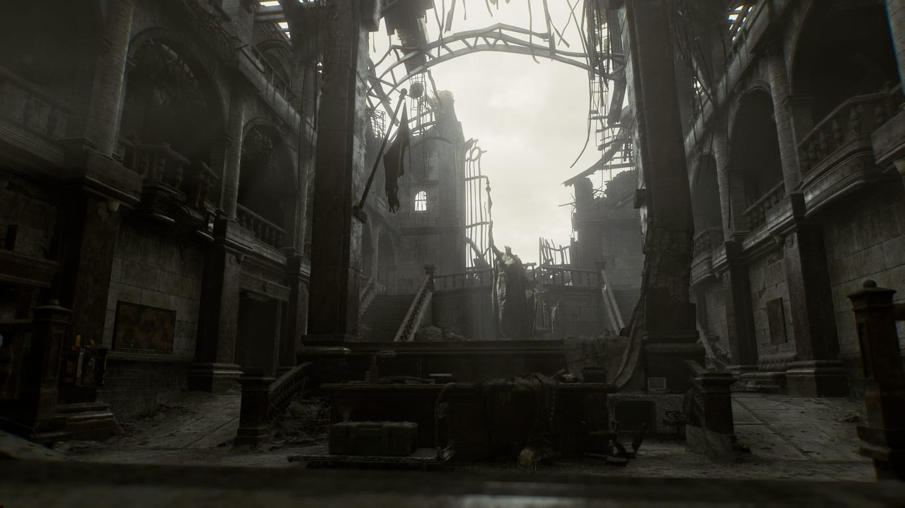
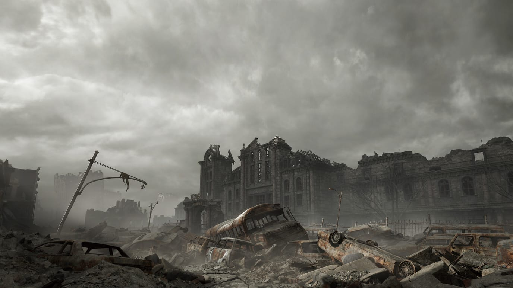
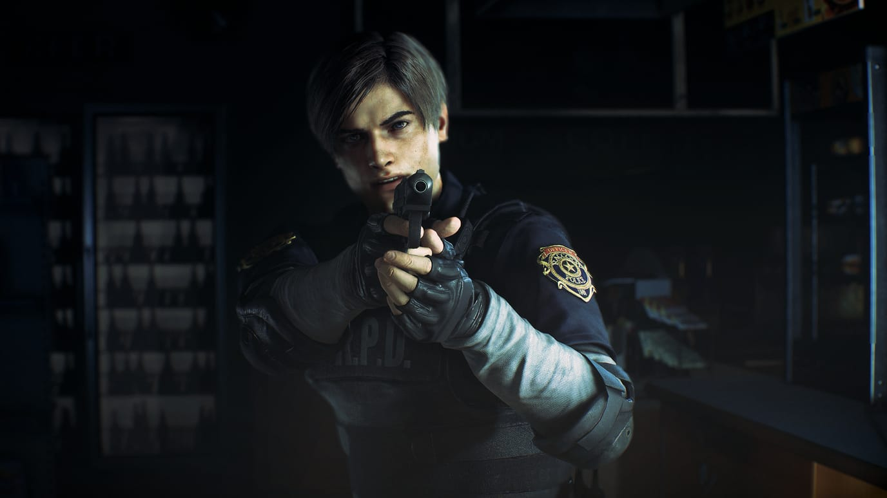
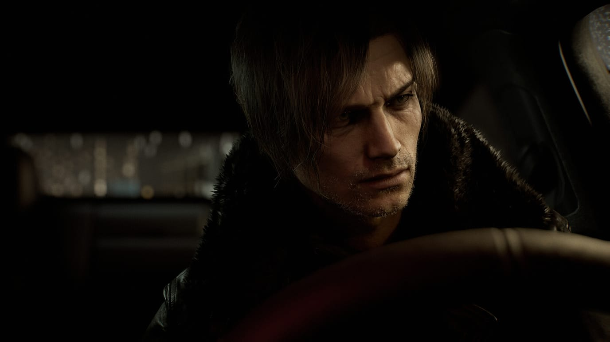

> [!summary]- Quick Summary
>
> - Returning to the ruined Raccoon City Police Department feels like revisiting a real place, not just replaying an old game level.
> - Games build “place-memory” by making you learn layouts with your own movement in a way films can’t.
> - Characters like Leon, Jill, and new additions like Grace carry those places through time, aging and changing alongside players.
> - These fictional spaces only exist in players’ heads, but the grief and attachment they trigger are as real as memories of physical locations.
>
> AI-generated summary based on the text of the article and checked by the author. [Read more](/artificial-intelligence-tools/ "BUT. Honestly Artificial Intelligence Tools") about how BUT. Honestly uses AI.

![[buildings-never-were.mp3]]

I walked into a police station that doesn’t exist and knew exactly where to go.

Past the entryway with the empty front desk. Down the hall toward the records room. The path felt familiar — like walking back through my old high school. The layout was cached in some part of my brain I didn’t know was storing it.

This was the Raccoon City Police Department. The RPD. The building that anchors the second Resident Evil game from 1998, its 2019 remake, and the third game from a different angle. And now the ninth, where I’d just walked in for the first time in years.

A cutscene showed the “Welcome Leon” ribbon. The same one his fellow officers had put up for him on his first day at the precinct. Inside the fiction, the ribbon is a taunt — Leon’s antagonist using a fragment of the past against him. I wasn’t who the taunt was for. It caught me anyway.

The studio knew it would.

Why does this hit so hard, for what is, objectively, a fictional building?

## Before the Argument, the Place

A note for anyone who hasn’t played the games. The Raccoon City Police Department is the central setting of Resident Evil 2. An ornate building, marble staircases and dark wood, locked doors, rooms full of files. Players spend hours inside it.

The game forces a slow, deliberate kind of movement: zombies in the halls, limited ammo, a map you keep checking.

That’s the part that does it. You don’t watch the building. You navigate it. You learn which corridor connects to which, which locked door takes the key you found in the office, which window leads back to the lobby. By the time you finish, the layout is a thing your hands have learned the way your hands know your own kitchen.

The same building returns in Resident Evil 3 from another angle, in spin-offs and remakes, and now in Resident Evil 9. Each time, the studio assumes you remember.

## Three That Hit Hardest

First, the street outside. In Resident Evil 2 and 3, the approach to the RPD was zombies in the open and cars blocking the passages.

Resident Evil 9 brings you back to that same approach. The cars are in the same spots. I recognized geography that doesn’t exist.

Second, the building itself. Years have passed in the fiction and the place is in ruins. Offices wrecked, ceilings down, blood where there wasn’t blood before.

But the map I’d built as a kid playing the original Resident Evil 3 still applied. The locked door I expected to find a key for was still locked. The ruin didn’t erase the layout. It sat on top of it.

Third, the people. Or who you expected to see.

You move through corridors hoping for familiar faces. Or dreading them.

I expected to find Chief Irons. Or Kendo and his daughter, from the second game’s gun shop. None of them appear.

The entire RPD holds one officer zombie. And Mr X.

You don’t expect Mr X back. But the moment you see him you know what he can do. You know what you have to do. Run.

## The Orphanage

In Resident Evil 2 there’s an orphanage. You pass through it briefly: party bunting strung across the ceiling, children’s drawings on the wall, a play mat on the floor. The colors are warm. A missing child is hiding somewhere inside.

You spend the segment trying to reach her. The kind of place a horror game uses to make you feel something fast.

Resident Evil 9 reaches back into that memory and changes what it was.

The orphanage was a facade. The same playroom you walked through, the bunting still hanging, the drawings still pinned to the wall, was a front for experiments. On children.

The place existed to do something far worse to children than abandonment. The kids you couldn’t see, the ones the orphanage was officially housing, were the experiments.

And then Resident Evil 9 puts you in that same playroom. You play as Chloe, one of the experimented children.

The bunting is the same. The drawings are the same. The play mat is in the same place.

You’re not trying to reach a missing child anymore. You’re the child. The version of the story you didn’t see in the original game is the version you live this time.

The segment is a flashback. Chloe is gone by the time the game’s present begins. The room you walk through is a memory of a girl who isn’t there anymore.

This is the hardest kind of place-memory to carry. The room you thought was sad is now horrific. The room you thought was a setting is now a stage you stand on.

The original feeling doesn’t survive the new context. You don’t get to keep the version where the orphanage was just an orphanage.

The studio is doing something specific here. They’re not adding a new building. They’re rewriting one you already had a relationship with, and casting you in a role you didn’t know existed.

It flows backward through your memory of the original game. You can’t unsee it.

## Characters as Place-Memory

Buildings aren’t the only thing the franchise carries forward. The characters do, too. And they age.

Leon was new in 1998. A young officer fresh out of training, in over his head in a city overrun by zombies.

He came back in RE4 a few years older, still scrambling. He came back again across the years, the games marking the time. In Resident Evil 9 he’s visibly older.

You age with him whether you like it or not.

This is what films can’t do at the same scale. A character in a franchise that releases every three or four years ages in real time alongside you.

My attachment timeline runs Jill first, as a kid playing the original Resident Evil 3. Then Leon, years later, in the RE2 remake. Then Ada, returning in RE4.

Each is bound to a phase of my own life as much as to the franchise’s. The order I met them is a record of when I was the person who met them.

And then Resident Evil 9 introduces Grace. A new main character alongside Leon, an FBI technical analyst sent to investigate a string of deaths in a small town.

She’s anxious, in over her head, weak the way an analyst is weak when a quick investigation becomes a bioweapons lab. Realistic, in the sense that any character in a fictional world of zombies can be realistic.

You don’t know if she’ll be back. That’s the part the medium does to you.

A franchise introduces someone you’d hope to see again, and the next game is already a low-grade dread: will she be there? Will she still be alive?

You start carrying her before the next game exists.

## The Crossover Proves It

If the attachment were just to the games, it would stop at the games. It doesn’t.

Dead by Daylight is a multiplayer horror game made by a different studio. It has its own world, its own mechanics, its own players. And it has the RPD as a map.

You drop into Dead by Daylight’s RPD as a Survivor. The lobby is the lobby. The east office is the east office. The staircase to the second floor is exactly where you remember it.

It’s a different game by a different studio, and the layout sits on top of your existing memory perfectly.

Leon and Jill are playable Survivors. Wesker and Nemesis are Killers. The crossover isn’t just a marketing handshake. It works because the players bringing place-memory into a horror multiplayer game already know how the building flows.

The proof: memory architectures travel.

There’s a smaller version inside the franchise itself. Resident Evil 9 has files that explain what lickers are: long-tongued bioweapons, sightless, hunting by sound. The files are doing their job for a new player.

But you already know. You learned it the hard way, listening for them in the dark.

The franchise has been counting on this kind of memory for thirty years. Some of it comes back through the files you read. Some of it comes back when a different studio recreates the same hallway and you walk through it like you live there.

## “It’s Just a Game”

It’s just a game. Get over it.

I’ve heard the dismissal. I’ve said it to myself. It doesn’t survive contact with what actually happens.

The grief at walking into a familiar building isn’t fan loyalty. It’s something the medium specifically does to you. You didn’t watch someone walk through this place. You walked through it.

That’s not the same as being moved by a film. A film puts a character in a space and shows you the space through the camera. You’re an observer. The relationship to place is the relationship of a tourist.

Games hand you the wheel. You move. You’re the one who turned down that corridor. You’re the one who tried that door.

The building is in your hands, not behind a frame.

Years later, walking back into the same building isn’t nostalgia for a movie set. It’s nostalgia for somewhere you’ve been.

So this isn’t parasocial attachment to a character. It’s spatial attachment to a place. The fact that the place is fictional doesn’t make the attachment fictional.

There’s a harder question underneath. Is this a healthy kind of memory to keep, or is it wasted emotional bandwidth?

I have an unusual answer to that one. I process emotions differently: combined ADHD, low empathy. I rarely care about anything or anyone.

Things bounce off me that should land. I’ve written about this in [[learning-care-without-feeling|Learning to Care Without Feeling It]].

So when I walked back into the RPD and felt something I felt twenty-plus years ago, the noteworthy part wasn’t the feeling. It was that I felt anything at all.

A place I’d never been managed to land where most real things don’t. That’s not a waste of bandwidth. That’s a small, accidental proof that there’s still bandwidth available.

## Memory, Not Escapism

What I’m describing isn’t loyalty. It’s not nostalgia in the comforting sense. It’s not parasocial attachment, even though people will call it that.

It’s a working map of a place that doesn’t exist. A relationship with people who were never people. A grief, on revisit, that’s exactly the size of a real grief.

Long-running games do this to you over decades. Multiple games, multiple consoles, multiple phases of your own life — and at the end you can still find the records room with your eyes closed.

The franchise built a building inside your head and let it sit there. Sometimes other studios borrowed the floor plan. Sometimes the building came back rewritten. Either way, the map persisted.

This isn’t escapism. Escapism is a thing you do once, briefly, to step out of your life. What I’m describing is something the medium quietly did to me across most of my life.

The building was never out there. It was always in here.

The claim is small but not soft: memory anchors don’t have to be physical to be real. You can know your way around a place you’ve never been. You can grieve a hallway that doesn’t exist.

You can carry the maps of buildings that were never built. Returning to them feels like returning to a school you went to.

Thirty years of zombies in a fictional precinct, and somewhere in your wiring there’s a city plan for Raccoon City marked “personal.”

## What the RPD Remembers

I still know which hallway leads to the records room. I’ll know it next year. I’ll probably know it for the rest of my life.

That used to feel like a quirk. A waste of mental space.

It doesn’t anymore. The building was never the point. The fact that I remember it, that some part of my wiring decided this was worth keeping, is the point.

What the RPD remembers is me remembering it. That’s enough.
