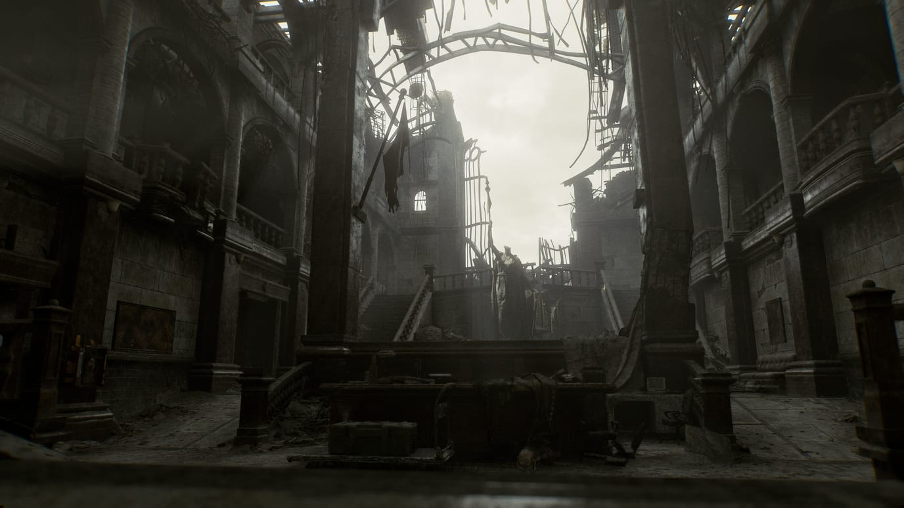
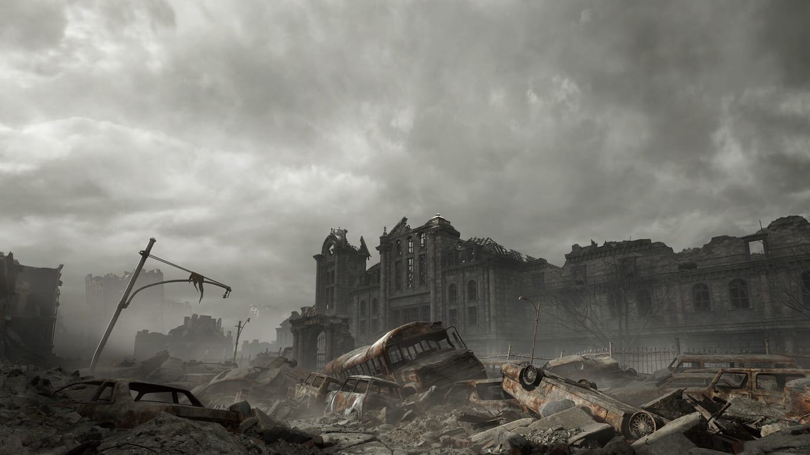
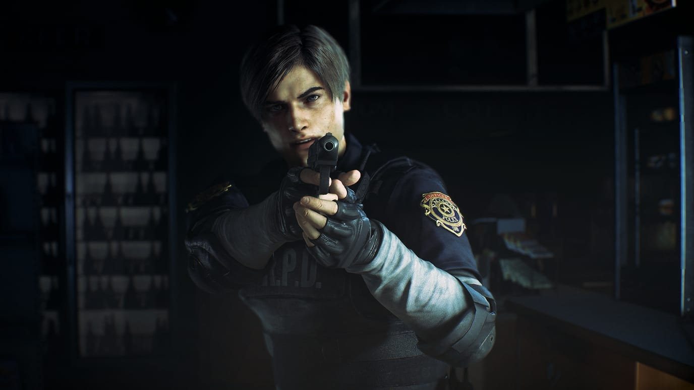
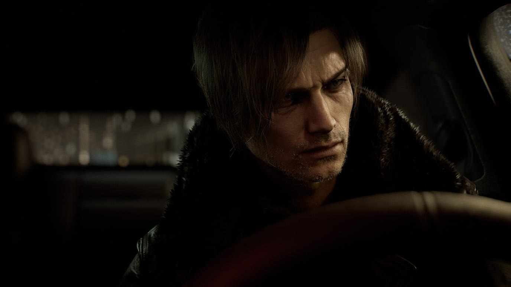
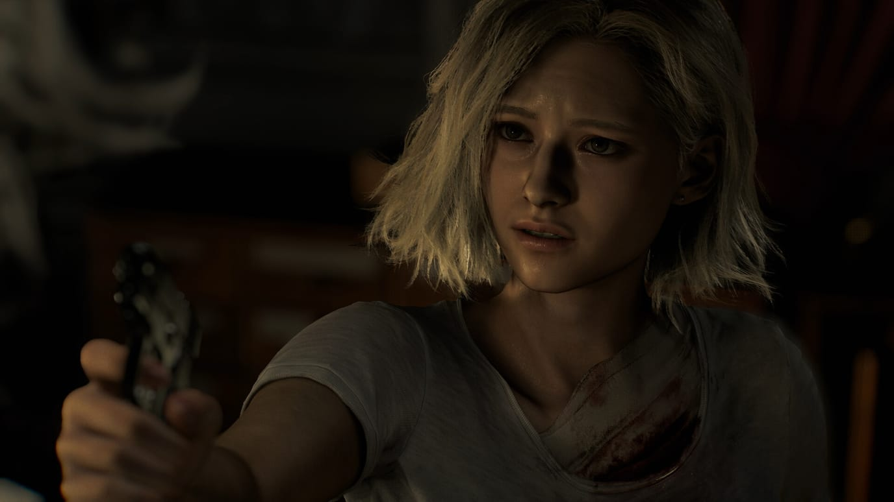

> [!summary]- Quick Summary
>
> - Returning to the ruined Raccoon City Police Department feels like going back to a real place, not replaying an old game level.
> - Games make you learn a layout by moving through it yourself, which is why the map sticks in a way a film never manages.
> - Characters like Leon, Jill, and now Grace carry those places through time. They age while you do.
> - The buildings only exist in your head, and the attachment to them is still real.
>
> AI-generated summary based on the text of the article and checked by the author. [Read more](/artificial-intelligence-tools/ "BUT. Honestly Artificial Intelligence Tools") about how BUT. Honestly uses AI.

![[buildings-never-were.mp3]]

I walked into a police station that doesn’t exist and knew exactly where to go.

Past the entryway with the empty front desk. Down the hall toward the records room. The path felt familiar, like walking back through my old high school. Some part of my brain had been holding onto the layout without telling me.

This was the Raccoon City Police Department. The RPD. The building that anchors the second Resident Evil game from 1998, its 2019 remake, and the third game from a different angle. And now the ninth, where I’d just walked in for the first time in years.

A cutscene showed the “Welcome Leon” ribbon. The same one his fellow officers had put up for him on his first day at the precinct. Inside the fiction, the ribbon is a taunt — Leon’s antagonist using a fragment of the past against him. I wasn’t who the taunt was for. It caught me anyway.

The studio knew it would.

Why does this hit so hard, for what is, objectively, a fictional building?

## The Building Itself

A note for anyone who hasn’t played the games. The Raccoon City Police Department is the central setting of Resident Evil 2. An ornate building, marble staircases and dark wood, locked doors, rooms full of files. You spend hours inside it.

The game forces a slow, careful kind of movement: zombies in the halls, limited ammo, a map you keep checking.

That is the part that does it. I didn’t watch the building, I moved through it. I learned which corridor connects to which, which locked door takes the key from the office, which window drops back into the lobby. By the time I finished, I knew the place the way I know my own kitchen.

The same building returns in Resident Evil 3 from another angle, in spin-offs and remakes, and now in Resident Evil 9. Each time, the studio assumes you remember.

## Three That Hit Hardest

First, the street outside. In Resident Evil 2 and 3, the approach to the RPD was zombies in the open and cars blocking the passages.

Resident Evil 9 brings you back to that same approach. The cars are in the same spots. I recognized geography that doesn’t exist.

Second, the building itself. Years have passed in the fiction and the place is in ruins. Offices wrecked, ceilings down, blood where there wasn’t blood before.

But the map I’d built as a kid playing the original Resident Evil 3 still worked. The locked door I expected to find a key for was still locked. The ruin didn’t erase the layout, it sat on top of it.

Third, the people. Or the ones I expected to see.

I moved through the corridors hoping for familiar faces, and dreading a few of them. I expected Chief Irons, or Kendo and his daughter from the second game’s gun shop. None of them appear.

The entire RPD holds one officer zombie. And Mr X.

You don’t expect Mr X back. But the moment you see him you know what he can do, and you know what you have to do. Run.

## The Orphanage

In Resident Evil 2 there’s an orphanage. You pass through it briefly: party bunting strung across the ceiling, children’s drawings on the wall, a play mat on the floor. The colors are warm. A missing child is hiding somewhere inside.

You spend the segment trying to reach her. It is the kind of place a horror game uses to make you feel something fast.

Resident Evil 9 reaches back into that memory and changes what it was.

The orphanage was a front. The same playroom I walked through, the bunting still hanging, the drawings still pinned to the wall, was cover for experiments. On children.

The kids I couldn’t see, the ones the orphanage was officially housing, were the experiments.

And then Resident Evil 9 puts you in that same playroom. You play as Chloe, one of the experimented children.

> The bunting is the same. The drawings are the same. The play mat is in the same place.

You’re not trying to reach a missing child anymore. You’re the child. The part of the story I didn’t see in the original game is the part I live through this time.

The segment is a flashback. Chloe is gone by the time the game’s present begins. The room you walk through is a memory of a girl who isn’t there anymore.

That is the hardest kind of memory to have rewritten. The room I thought was sad turned out to be much worse, and I wasn’t passing through it this time. I was standing in it, as one of the children.

The studio isn’t adding a new building here. They are rewriting one I already had a relationship with, and casting me in a role I didn’t know existed. It runs backward through my memory of the original game, and I can’t unsee it.

## Characters as Place-Memory

Buildings aren’t the only thing the franchise carries forward. The characters do, too. And they age.

Leon was new in 1998. A young officer fresh out of training, in over his head in a city overrun by zombies.

He came back in RE4 a few years older, still scrambling. He came back again across the years, the games marking the time. In Resident Evil 9 he’s visibly older.

You age with him whether you like it or not.

Films can’t do this at the same scale. A character in a franchise that ships every three or four years ages in real time alongside you.

My own order runs Jill first, as a kid playing the original Resident Evil 3. Then Leon, years later, in the RE2 remake. Then Ada, returning in RE4. Each one is tied to a phase of my life as much as to the franchise. The order I met them tells me who I was when I met them.

And then Resident Evil 9 introduces Grace. A new main character alongside Leon, an FBI technical analyst sent to investigate a string of deaths in a small town.

She’s anxious and out of her depth, weak the way an analyst is weak when a quick investigation turns into a bioweapons lab. Realistic, as far as anyone in a world of zombies can be realistic.

I don’t know if she’ll be back, and that is the part the medium does to you. A franchise introduces someone you want to see again, and the next game already comes with a low hum of worry: will she be there, and will she still be alive?

You start carrying her before the next game exists.

## The Crossover

If the attachment were only to the games, it would stop at the games. It doesn’t.

Dead by Daylight is a multiplayer horror game made by a different studio. It has its own world, its own mechanics, its own players. And it has the RPD as a map.

You drop into Dead by Daylight’s RPD as a Survivor. The lobby is the lobby. The east office is the east office. The staircase to the second floor is exactly where you remember it. Different game, different studio, and the layout sits on top of the memory I already had.

Leon and Jill are playable Survivors. Wesker and Nemesis are Killers. The crossover works because the players walking into that map already know how the building flows.

There’s a smaller version of this inside the franchise. Resident Evil 9 has files explaining what lickers are: long-tongued bioweapons, sightless, hunting by sound. The files are doing their job for a new player.

But I already knew. I learned it the hard way, listening for them in the dark.

The franchise has been counting on that for thirty years. Some of it comes back through the files you read. Some of it comes back when a different studio rebuilds the same hallway and you walk through it like you live there.

## “It’s Just a Game”

It’s just a game. Get over it.

I’ve heard that. I’ve said it to myself. It doesn’t survive contact with what actually happens.

The grief at walking into a familiar building isn’t fan loyalty. It is something the medium does to you specifically. You didn’t watch someone walk through this place. You walked through it.

A film puts a character in a space and shows you that space through the camera. You watch. Your relationship to the place is a tourist’s.

Games hand you the wheel. You move. You’re the one who turned down that corridor, and you’re the one who tried that door.

So walking back in years later isn’t nostalgia for a movie set. It’s nostalgia for somewhere I’ve been. The place is fictional. The attachment isn’t.

There’s a harder question underneath. Is this a healthy sort of memory to keep, or is it wasted emotional bandwidth?

I have an unusual answer to that one. I process emotions differently: combined ADHD, low empathy. I rarely care about anything or anyone. Things bounce off me that should land, and I’ve written about that in [[learning-care-without-feeling|Learning to Care Without Feeling It]].

So when I walked back into the RPD and felt something I last felt twenty-odd years ago, the surprising part wasn’t the feeling. It was that I felt anything at all.

A place I’d never been landed where most real things don’t. I’ll take that over wasted bandwidth. It tells me there is still bandwidth to use.

## Memory, Not Escapism

What I’m describing isn’t loyalty, and it isn’t nostalgia in the comfortable sense. It is a working map of a place that doesn’t exist, and a grief on revisiting it that is the same size as a real one.

Long-running games do this to you over decades. Multiple games, multiple consoles, multiple phases of your own life, and at the end you can still find the records room with your eyes closed. It is the same reason games taught me things [[gaming-made-me-better-leader|I could not learn from a management book]].

The franchise built a building inside my head and left it there. Sometimes another studio borrowed the floor plan. Sometimes the building came back rewritten. The map held either way.

Escapism is something you do once, briefly, to step out of your life. This was something the medium did to me slowly, across most of mine.

The building was never out there.

I think the claim is a small one. A memory doesn’t have to be attached to a physical place to be real. You can know your way around somewhere you’ve never been, and you can grieve a hallway that doesn’t exist. Going back to one feels like going back to a school you actually attended.

Thirty years of zombies in a fictional precinct, and somewhere in my head there is a map of Raccoon City filed under personal.

## What the RPD Remembers

I still know which hallway leads to the records room. I’ll know it next year. I’ll probably know it for the rest of my life.

That used to feel like a quirk, a waste of the space it takes up.

It doesn’t anymore. The building was never the point. The point is that I remember it, and that some part of me decided this was worth keeping.
