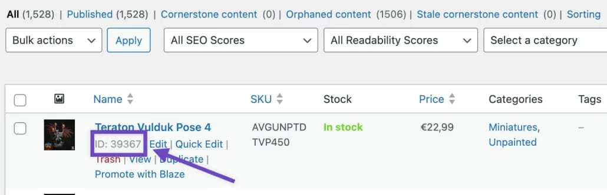
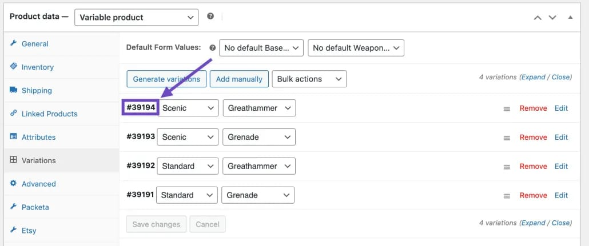
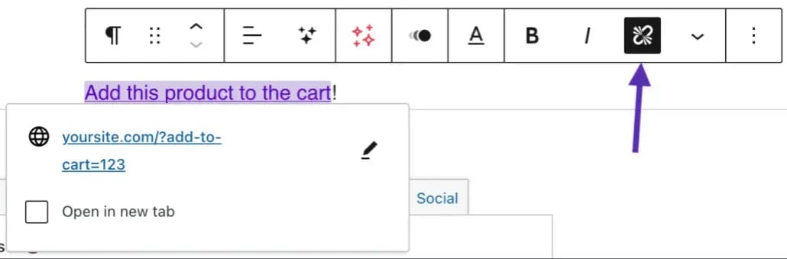
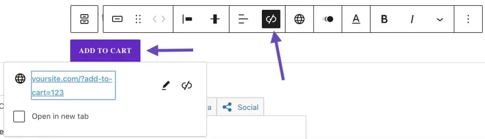

> [!summary]- Quick Summary
>
> AI-generated summary based on the text of the article and checked by the author. [Read more](/artificial-intelligence-tools/ "BUT. Honestly Artificial Intelligence Tools") about how BUT. Honestly uses AI.

Turning visitors into buyers on your online store starts with an easy Add to Cart process.

WooCommerce lets you add products normally, but sometimes you need something special. Adding a custom button linked to the Add to Cart link can really make a difference!

## Custom Add to Cart Link for Simple Products

**Step 1**: Find the product ID under Products > All Products in your dashboard.

**Step 2**: add `?add-to-cart=[Product ID]&quantity=1` to your website’s base URL. This creates a link like `https://www.yourwebsite.com/?add-to-cart=39367&quantity=1` that puts the product directly in the cart of those who click it.

### Redirects After Add to Cart

If you want customers to go to a specific page after adding a product, change the URL. For example, to send them to the Checkout page, use `https://yourwebsite.com/checkout/?add-to-cart=[Product ID]&quantity=1`. Make sure the URL is that of your Cart or Checkout page.

### Adjusting Product Quantities

You can easily adjust how many products are added by changing `&quantity=X` in the URL, where X is the number you want to add to the cart

## Custom Add to Cart Link for Variable Products

With new WooCommerce versions, this process is simpler. It’s like with simple products, but use the variation ID found under Variations on the Edit Product page.

The link is made in the same way, but you use the variation ID instead of the product ID, like this:

- Redirect to the Homepage: `` https://yourwebsite.com/?add-to-cart=[Variation ID]`&quantity=1` ``
- Redirect to the Cart: `` https://yourwebsite.com/cart/?add-to-cart=[Variation ID]`&quantity=1` ``
- Redirect to the Checkout: `` https://yourwebsite.com/checkout/?add-to-cart=[Variation ID]`&quantity=1` ``
- Redirect to any page: `` https://yourwebsite.com/page-slug/?add-to-cart=[Variation ID]`&quantity=1` ``

## Custom Add to Cart Link for Grouped Products

The add to cart link is slightly different when dealing with grouped products with multiple sub-products. Use the Grouped Product ID with the IDs and quantities of each sub-product. For instance, `https://yourdomain.com/?add-to-cart=1234&quantity[5678]=5&quantity[7890]=2` adds certain amounts of sub-products to the cart.

## How to Use the Custom Add to Cart Link

After making your link, adding it to your site is easy. It can be a simple link, a button, or part of a pricing table. You can place it in your content using the text editor or as a button in a Button Block.

- Create a simple add-to-cart link anywhere in your content by using the text editor:

- Or using a [Button block](https://wordpress.org/documentation/article/buttons-block/):

There are many more ways; for example, you might want to use it as part of a pricing table block or shortcode or as a heading or another type of block. The options are virtually limitless. If you can add a link, that link can be a custom WooCommerce Add to Cart link.
