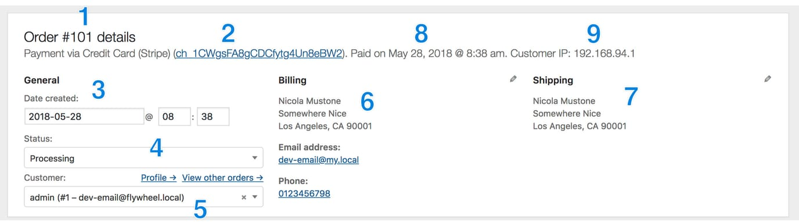
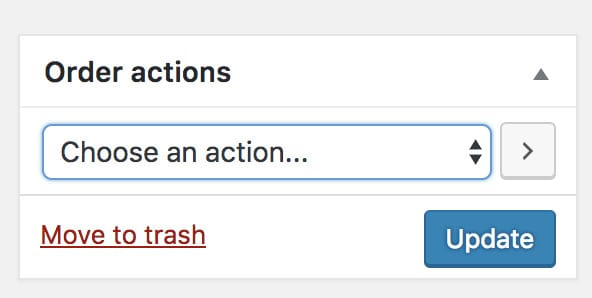
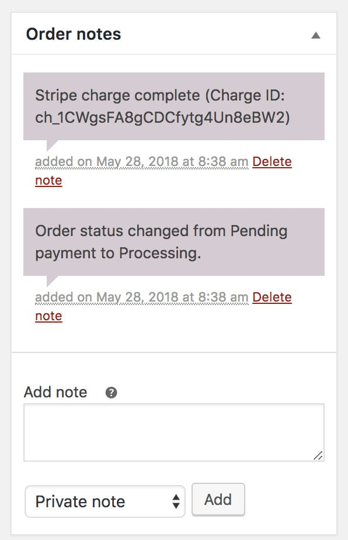
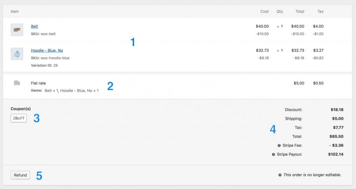
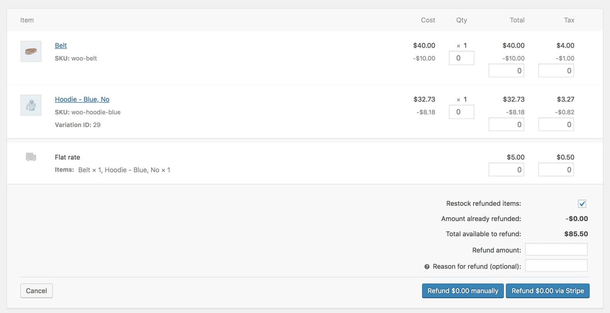
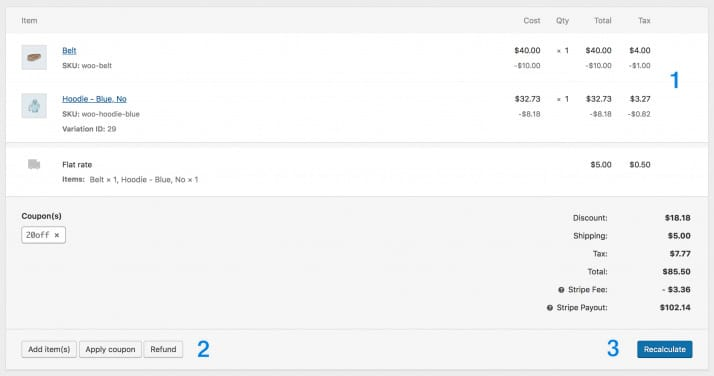

> [!summary]- Quick Summary
>
> - New orders need active handling: check details, adjust them for customer needs, and keep order status aligned with reality.
> - Most fields can be edited directly on the order screen, including billing, shipping, items, shipping methods, coupons, and totals.
> - What you can change depends on status: once an order is Processing or beyond, rely on refunds instead of silently changing totals.
> - Use order actions and notes to resend emails, add context, and communicate clearly with customers without leaking private comments.
> - After any change that affects money, recalculate totals and update the order so reports, stock, and customer expectations stay correct.
>
> AI-generated summary based on the text of the article and checked by the author. [Read more](/artificial-intelligence-tools/ "BUT. Honestly Artificial Intelligence Tools") about how BUT. Honestly uses AI.

Raise your hand if you like to get the New Order email notification in your inbox!

Yeah, I know, everyone would raise their hand! But just receiving an order is not enough. You need to handle it properly, and sometimes edit it to meet the customer needs.

Learn here all the details about how to edit orders in WooCommerce.

## Order details

- The order number
- The payment method and the transaction ID
- The date when the order has been created
- The order status
- The customer username and email and links to their profile and other orders
- The customer billing data
- The customer shipping data
- The date when the order has been paid for
- The customer IP

Not all of these data can be changed by the administrator. For example, the order number (1), the payment date (8), the customer IP (9), and the transaction ID (2) cannot be easily changed and should not be changed.

To change the order status (4) click on the little arrow in the status field and choose the new one as needed. The same goes for the customer (5): click on the little `x` to remove the currently assigned customer and then click on the arrow to show a search field to select the new customer.

Editing the billing (6) and shipping (7) details is possible by clicking the pencil icon next to each address. By editing the billing details you can also change some transaction details, but I recommend not to do it unless you know exactly what to write in those fields (and only if necessary).

## Order actions and notes

On the right side the first section shown is the **Order** **actions**:

This section allows you to resend the order notifications and regenerate the download permissions for downloadable products, if any.

Right next to the order actions you have the **Order** **notes**:

There are two types of order notes, customer notes, and private notes. You can easily recognize them by their color. If their background is purple or grey, they are private notes. If the background is blue they are customer notes.

You can also add new notes by using the text area at the bottom, and choose the proper note type before to click on **Add**. Note that if you choose to write a customer note an email containing the text of the note will be sent to the customer and you cannot stop this.

> [!tip]
> Be professional in order notes as well, no matter if they are private or not. It’s very easy to make a mistake and send a private note containing something private (or offensive) to the customer.

## Order items

Next is probably the part of an order that you are going to use most. The order items list.

- The purchased items list
- The shipping method
- The coupons applied to the order (if any)
- The order totals
- The refund button

This part is not editable all the time. By default, only if the order status is less than Processing will it be possible to edit these data.

This limit is because once the order status is Processing it means that the customer already paid for it, and you should not just make changes. You should instead process refunds for the entire order, or just partial refunds for taxes, shipping, items, etc., to apply changes.

To do so, click on the Refund button (5) and fill in the fields as necessary:

If the order status is less than Processing, for example, **On Hold**, you can make further adjustments before the customer pays, like adding/editing/removing items, taxes, shipping, etc. and the order items section will look a bit different:

- Order items. Hovering over this part will show a pencil icon to edit the product data, or a `x` to remove the item from the order.
- The buttons to add new items, shipping methods, and coupons
- The recalculate totals button

By clicking on **Add** **item(s)**, more buttons will show, allowing you to choose what item to add:

Once you are done making changes if any of these changes should change the order total make sure to click on the **Recalculate** button, and then **Update** the order.
