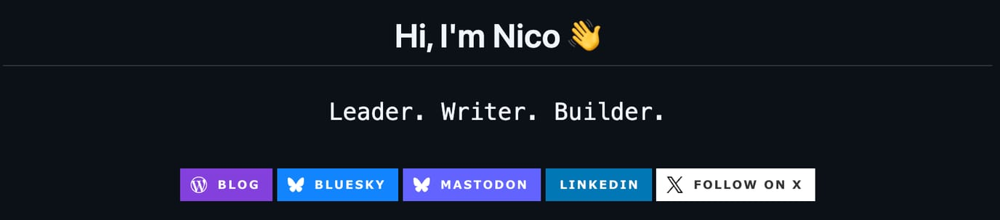

> [!summary]- Quick Summary
>
> - **Your GitHub profile README should feel personal, not performative.**
> - It works best when it shows who you are, what you care about, and how you approach your work. **Start simple, then add structure.**
> - A good README can include a short intro, current projects, tools you use, ways to connect, and a few useful links. **Dynamic sections can help, but only if they serve the page.**
> - Badges, GitHub stats, recent posts, and GitHub Actions are useful when they add context, not clutter. **The goal is clarity, not decoration.**
> - A strong profile README should be easy to read, easy to maintain, and honest enough to feel like you.
>
> AI-generated summary based on the text of the article and checked by the author. [Read more](/artificial-intelligence-tools/ "BUT. Honestly Artificial Intelligence Tools") about how BUT. Honestly uses AI.

Your GitHub profile README can be more than a résumé — it can be a snapshot of who you are, what you care about, and the kind of work you enjoy building.

When someone visits your GitHub profile, they see two things first: your pinned repositories and your profile README. That single markdown file can do a lot: introduce you, showcase your work, or even update itself automatically.

You don’t need to be a full-time developer to build one. Whether you’re a designer sharing prototypes, a technical writer linking to your work, or a manager experimenting with automation scripts, your profile can show what you do, and how you think.

This GitHub profile README tutorial shows you how to customize your GitHub profile README from scratch, customize your GitHub profile with badges and automation, and use GitHub README automation to keep it fresh.

## How to Build a GitHub Profile README

GitHub treats a repository named exactly after your username as special. If your username is `SirDarcanos`, then a repo called `` `SirDarcanos`/`SirDarcanos` `` will display its `README.md` at the top of your profile.

To create one now:

1.  Go to **New Repository**.
2.  Name it exactly as your username.
3.  Check **Add a README**.
4.  Save.

That’s it, the file will instantly appear on your profile. You can edit it directly on GitHub or locally using Markdown.

A few tips:

- Markdown supports **HTML**, so you can use alignment, badges, and custom layouts.
- You can preview the file live by clicking **“Preview”** while editing.
- You can use comments (`<!-- like this -->`) to create placeholder sections for future automation. Comments won’t show in the rendered file.

## Start with a Header That Grabs Attention

Your first line sets the tone. It can be as simple as a friendly greeting or as bold as an animated header.

For example, here’s how I start mine:

```xml
<h1 align="center">Hi, I'm Nico 👋</h1>
<p align="center">
  <a href="https://buthonestly.io/"></a>
</p>
```

This uses [readme-typing-svg](https://readme-typing-svg.demolab.com/demo/) to animate a few short lines of text and badges for my links (more on this below). It adds personality without clutter. This is how it looks like:



You could also:

- Add a static banner image made with Figma or Canva.
- Keep it plain text if you prefer minimalism.
- Use emoji for warmth (👍, 💻, ✨).

Your header doesn’t need to shout, it just needs to represent _you_.

## Add Badges for Links and Tools

Badges are small images that make information visually scannable.  
They’re powered by [Shields.io](https://shields.io) and support logos, colors, and links.

Example (from my profile):

```markdown
<p align="center">
  <a href="https://buthonestly.io/" target="_blank"></a>
  <a href="https://www.linkedin.com/in/nicolamustone/" target="_blank"></a>
  <a href="https://x.com/intent/follow?screen_name=nicolamustone&tw_p=followbutton" target="_blank"></a>
  <a href="https://profiles.wordpress.org/nicolamustone/" target="_blank"></a>
</p>
```

These badges make your key links visible without forcing visitors to scroll or read through long paragraphs.

You can create badges for:

- Your website or blog
- Social media (LinkedIn, Mastodon, X, etc.)
- Tools you use (Python, Docker, Figma)
- Status or metrics (“Open to work”, “Currently learning Go”, “Building something new”)

Keep them consistent in shape and color scheme.  
For professional profiles, a single row of badges is enough. Anything more can distract from your content.

## Structure Your Content with Intention

Think of your README like a personal home page. Every section should have a reason to exist.

Here’s how I structured mine:

1.  **Introduction** – a short paragraph about what I do.
2.  **What Drives My Work** – personal philosophy and focus areas.
3.  **Tech I Use** – badges for my stack.
4.  **My Writing** – lists of blog posts (automated).
5.  **Outside of Work** – personal hobbies for a human touch.

You don’t need all of these, but you could have at least:

- One **section about you** (the human part).
- One **section about what you build or write** (the work part).

That balance makes the page feel personal yet purposeful.

## Show the Tools You Work With

A visual “tech stack” section is a great middle ground between design and substance.

Example snippet:

```markdown
<p>
  
  
  
  
  
  
</p>
```

You can use badges, plain lists, or even icons. Some designers prefer a visual grid of logos; developers often prefer badges with color codes that match their stack.

If you want to highlight versatility, group tools by category:

```markdown
**Languages:** Python, PHP, JavaScript
**Frameworks:** WordPress, FastAPI
**Tools:** Docker, Jupyter, GitHub Actions
```

This small change adds context and readability.

## Add Dynamic Content with GitHub Actions

This is where your README can evolve into something _alive_. Using GitHub Actions for blog posts and other content updates, your README becomes a living document that showcases your latest work automatically.

In my profile, I use these for sections like “Programming,” “Leadership,” and “Web Tech”:

```markdown
#### 🧠 Programming
<ul>
<!-- PROGRAMMING:START -->
<!-- PROGRAMMING:END -->
</ul>
```

Those comments tell a future automation (a GitHub Action) where to insert new content — like recent blog posts, GitHub commits, or other data.

For my profile, I created an action that pulls articles from my blog’s RSS feed and prints them. The file goes into the `.github/workflows/` folder in the repository. Name it `anything-you-like.yml`. The content will be the intructions to execute. For my profile it’s the following:

```yaml
name: Latest blog post workflow

on:
  schedule:
    - cron: "0 3 * * *" # Every day 03:00 UTC
  workflow_dispatch:

permissions:
  contents: write

jobs:
  update-readme-with-blog:
    runs-on: ubuntu-latest
    steps:
      - name: Update this repo's README with latest blog posts
        uses: actions/checkout@v4

      # Programming
      - name: Update Programming posts
        uses: gautamkrishnar/blog-post-workflow@master
        with:
          feed_list: "https://buthonestly.io/category/programming/feed/"
          max_post_count: 3
          comment_tag_name: "PROGRAMMING"
          template: "<li><em>$date</em> <a href='$url'>$title</a></li>"
          date_format: "UTC: yyyy-mm-dd"

      # Leadership
      - name: Update Leadership posts
        uses: gautamkrishnar/blog-post-workflow@master
        with:
          feed_list: "https://buthonestly.io/category/leadership/feed/"
          max_post_count: 3
          comment_tag_name: "LEADERSHIP"
          template: "<li><em>$date</em> <a href='$url'>$title</a></li>"
          date_format: "UTC: yyyy-mm-dd"

      # Web Tech
      - name: Update Web Tech posts
        uses: gautamkrishnar/blog-post-workflow@master
        with:
          feed_list: "https://buthonestly.io/category/web-tech/feed/"
          max_post_count: 3
          comment_tag_name: "WEB"
          template: "<li><em>$date</em> <a href='$url'>$title</a></li>"
          date_format: "UTC: yyyy-mm-dd"
```

How this automation works:

1.  GitHub Actions runs on a schedule (daily at 3 AM UTC)
2.  The action fetches my blog’s RSS feed
3.  It finds the HTML comments in my README (_<!– PROGRAMMING:START –>_)
4.  It updates the content between those comment tags
5.  It commits the changes automatically

## Add Personality and Story

A short personal section goes a long way.  
Even a single sentence can shift your profile from “technical” to “memorable.”

Example (mine):

```markdown
### Outside of work
When I’m not working, I’m probably:
- Running long-form *Dungeons & Dragons* campaigns
- Writing new essays on [buthonestly.io/](/)
- Coding on some project that will likely become public
- Or playing games (currently: *Dead by Daylight & Killing Floor 3*)
```

It gives people something human to remember.

Don’t overthink it, list what genuinely matters to you. It might be gaming, design, coffee, or travel. Just make it true.

## Keep It Maintainable

A README is easiest to maintain when it’s modular. Use small sections and clear dividers (`---`) so you can update parts without rewriting everything.

And if you decide to add automation later, the structure will make that process simpler.

A few maintenance tips:

- Update your links every few months.
- Avoid hardcoding years (“2023,” etc.).
- Keep badges lightweight, too many images can look heavy.

## Make It Yours

There’s no single “best” profile README. They vary wildly depending on who’s behind them, and that’s the point. The only rule: it should feel like you made it on purpose.

If your aesthetic is clean and structured, keep it that way. If you love motion and color, embrace it.

> “Your GitHub profile README is a canvas, not a résumé. Whether it’s a quiet list of skills or a fully animated dashboard, what matters is that it feels intentional and reflects you.”

If you’re proud of it, you’ll maintain it. And when you do, it becomes something more than a file, it becomes a reflection of your growth.

Below you’ll find some examples. You can [check out this curated list](https://github.com/abhisheknaiidu/awesome-github-profile-readme) for many more examples.

### The Minimalist

Clean text, maybe a single emoji. No badges, no banners. Great for people who want focus.

Example: [https://github.com/caneco/](https://github.com/caneco/)

### The Artistic

Visuals first. Banners, gradients, and color palettes.

Example: [https://github.com/m0nica](https://github.com/m0nica)

### The Automated

For people who love workflows. These READMEs update automatically — showing your latest blog posts, tweets, or even Spotify tracks.

Examples: [https://github.com/SirDarcanos](https://github.com/SirDarcanos)

### The Personality-Driven

Anime, gaming themes, or humor. Flashy, playful, but still authentic.

Examples: [https://github.com/Xx-Ashutosh-xX/](https://github.com/Xx-Ashutosh-xX/)

## Bringing It All Together

A GitHub profile README doesn’t need to impress everyone, it just needs to represent you clearly. The best ones evolve naturally over time: a short “About me” today, perhaps badges or automation later, and eventually something that grows alongside your work.

You don’t have to build it all at once. Start with a greeting, add what matters most, and refine it as you go. That’s the real advantage of [[write-in-markdown|using Markdown]]: it’s flexible and forgiving.

What matters most isn’t how flashy or minimalist it looks, but that it tells a small, honest story about what you do and how you think.

If someone visits your profile and instantly understands that, you’ve done it right.
