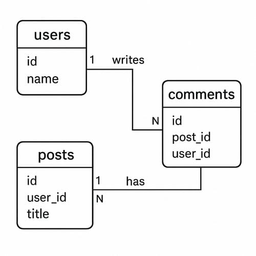

> [!summary]- Quick Summary
>
> - SQL vs NoSQL isn't mainly about speed; it's about choosing between structure and flexibility in your data.
> - An SQL database fits data with stable relationships.
> - A NoSQL database fits data that changes often or resists strict shape.
> - The database doesn't simplify the work; understanding your data does.
>
> AI-generated summary based on the text of the article and checked by the author. [Read more](/artificial-intelligence-tools/ "BUT. Honestly Artificial Intelligence Tools") about how BUT. Honestly uses AI.

New developers regularly hear arguments about SQL vs NoSQL as if picking the wrong one will sabotage their project. The debate gets framed as a rivalry rather than a decision grounded in how the data actually behaves. The real question is when your project needs an SQL database and when a NoSQL database fits better.

Explanations online tend to lean on buzzwords, benchmarks, or hype about scale. All of that creates noise. The core tension is simpler: an SQL database and a NoSQL database solve different problems, yet both are frequently used for the wrong ones.

This essay aims to clarify when to use NoSQL vs SQL by showing how each tool thinks, what each one protects you from, and how to recognize the shape of the problem you're solving.

## What an SQL Database Actually Gives You

An SQL database like MySQL stores information in tables with a defined structure. Each row follows that structure. The database enforces rules that keep your data consistent and predictable.

For beginners, this structure can feel restrictive. But that structure is a feature, not a limitation. It makes the relationships between pieces of data explicit, which becomes a powerful advantage as a system grows.

| id  | email               | created_at          |
| --- | ------------------- | ------------------- |
| 1   | alice@example.com   | 2025-01-03 10:15:22 |
| 2   | bob@example.org     | 2025-01-04 08:47:09 |
| 3   | charlie@example.net | 2025-01-04 12:03:55 |
| 4   | daniela@example.com | 2025-01-05 19:21:10 |
| 5   | eric@example.org    | 2025-01-06 07:02:41 |

## What a NoSQL Database Actually Gives You

A NoSQL database avoids the traditional table-and-row model. MongoDB stores documents. Redis stores key-value data. Cassandra stores wide-column data.

What they share is flexibility. You can store data with no fixed shape. You can change fields without migrations. The system assumes the data is evolving.

```json
// collection: users
{
  "id": 1,
  "email": "alice@example.com",
  "name": "Alice",
  "created_at": "2025-01-03T10:15:22Z",
  "profile": {
    "bio": "Coffee and backend code.",
    "website": "https://alice.dev"
  }
}
{
  "id": 2,
  "email": "bob@example.org",
  "created_at": "2025-01-04T08:47:09Z",
  "last_login_ip": "192.168.0.12",
  "preferences": {
    "newsletter": true
  }
}
{
  "id": 3,
  "email": "charlie@example.net",
  "name": "Charlie",
  "created_at": "2025-01-04T12:03:55Z",
  "profile": {
    "bio": "Learning Go and Rust."
  },
  "tags": ["beta-tester", "early-access"]
}
```

For example, I used MongoDB with my [[neural-network-predict-resin-usage-3d-printed-miniatures|3D print cost calculator]] because all of my models had different parts and I couldn't know beforehand what new parts new miniatures would have. I never had a strict structure I could follow.

## The Real Distinction in SQL vs NoSQL

Despite the online debates, both can scale, both can perform well, and both can support large systems.

The deeper difference is simple:

- An SQL database wants structure.
- A NoSQL database accepts change.

Choosing between them means choosing how much discipline you want the system to enforce.

## How MySQL Thinks

MySQL expects you to know the shape of your data. It gives you tools to define that shape clearly. It enforces constraints that prevent silent mistakes.

This makes it a strong fit for systems where relationships matter: online stores using [[improve-woocommerce-related-products-recommendations|attribute-based related products]], content platforms, booking systems, and financial tools.

A well-known example is WordPress, which has relied on MySQL from the start. Its data model is predictable: posts, comments, users, and metadata. An SQL database keeps this structure clean at scale.



### The Cost of Structure

An SQL database forces planning. It asks you to design your tables, consider relationships, and migrate carefully.

That can feel heavy early on. But the cost is mostly upfront. Once the system matures, the clarity pays off. Your future self can still understand the data.

## How NoSQL Thinks

A NoSQL database assumes your data may change tomorrow. Fields may appear. Fields may disappear. Structures may evolve.

This flexibility matters when the data is messy, user-generated, or still being discovered.

Early Foursquare is a classic case. Their check-in data changed constantly, and they needed to iterate without redesigning tables every week. A document-based NoSQL database let them move quickly while the product was still forming.

> _"NoSQL trades structure for speed when your data hasn't settled yet."_

### The Cost of Flexibility

A NoSQL database makes it easy to store anything. But that ease can become its own trap.

If you aren't careful, documents drift. Meanings shift. Validation gets scattered across the application. The database stops protecting you, and the burden moves entirely to your code.

Flexibility is powerful, but it requires discipline from developers, not the system.

## Performance Isn't the Core Difference

It's easy to assume NoSQL is always faster, or that SQL can't scale. Neither belief holds up.

An SQL database can handle far more traffic than beginners expect. And a NoSQL database is not automatically faster; it's optimized for workloads where relationships are weak or nonexistent.

The real decision isn't about performance. It's about the _shape_ and _stability_ of the data.

The question of when to use NoSQL vs SQL is not "Which database is better?" but "What shape does my data take and how stable should that shape be?"

Everything else follows from that.

## The Meaning Behind the Decision

The database you pick reflects the constraints you are willing to accept or avoid.

An SQL database is a commitment to clarity. It protects you from ambiguity by demanding structure.

A NoSQL database is a commitment to flexibility. It protects you from rigidity by allowing quick changes.

New developers sometimes pick NoSQL because the early friction is low. But low friction doesn't mean a good fit. SQL might feel heavier at the beginning, but it often leads to cleaner decisions later.

Both tools help you avoid mistakes, just in different ways.

An SQL database isn't as rigid as it seems. Schema migrations can be quick and safe when handled well.

A NoSQL database isn't inherently messy. Many teams add schema validation layers, indexing, and consistency rules.

| Mistakes SQL Prevents                                | Mistakes NoSQL Prevents                    |
| ---------------------------------------------------- | ------------------------------------------ |
| Invalid or inconsistent data types                   | Oversized or unbounded fields              |
| Broken relationships (missing or wrong foreign keys) | Poorly indexed queries causing slow reads  |
| Schema mismatches across rows                        | Partial data loss when writes aren't atomic |
| Duplicate data that should be relational             | Overly rigid schemas in fast-changing domains |

Plenty of systems start with NoSQL while the data is still fluid, then migrate to an SQL database once patterns solidify. Others do the opposite.

Real work is rarely tidy. The tools should adapt to the project, not the other way around.

## Practical Implications of SQL and NoSQL Databases

When your data has clear and stable relationships, an SQL database reduces cognitive load. The system carries the structure for you.

When the relationships are weak or still evolving, a NoSQL database often wins in the NoSQL vs SQL trade-off because it lets you adapt the shape of the data as you learn.

A simple question helps: _What will be more painful to change later, the structure or the flexibility?_

If changing structure is expensive, NoSQL buys you time.  
If losing clarity is expensive, SQL buys you safety.

## Bringing It Back to Practice

Most problems aren't about SQL vs NoSQL at all. They're about understanding the data deeply enough to choose the right constraints.

You choose based on the stability of your data and the velocity of the project.

Structure helps once the domain is clear. Flexibility helps when the domain is still taking shape. That's the real SQL vs NoSQL choice you're making.

The [[do-you-trust-your-instincts-making-smart-wordpress-choices|correct and smart choice]] is the one that makes future work simpler, not harder.
