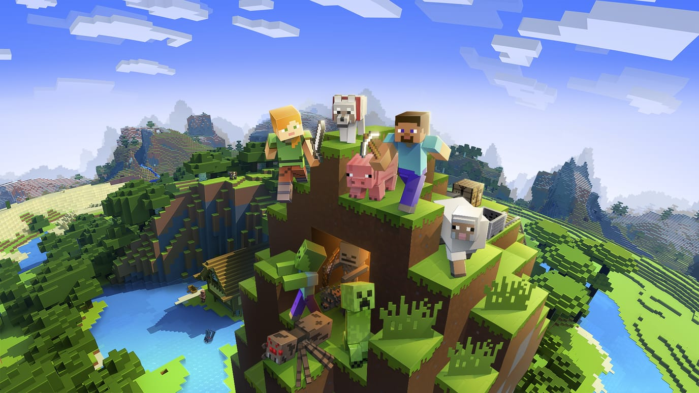
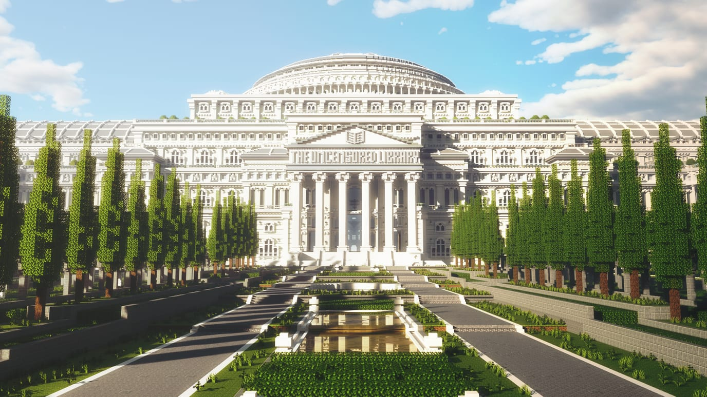
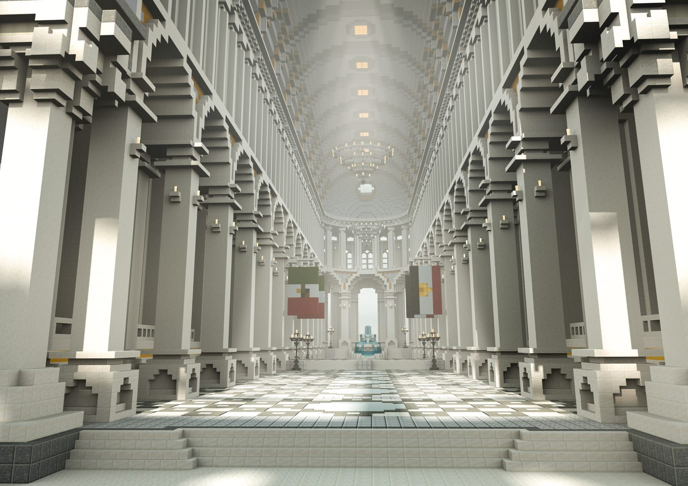
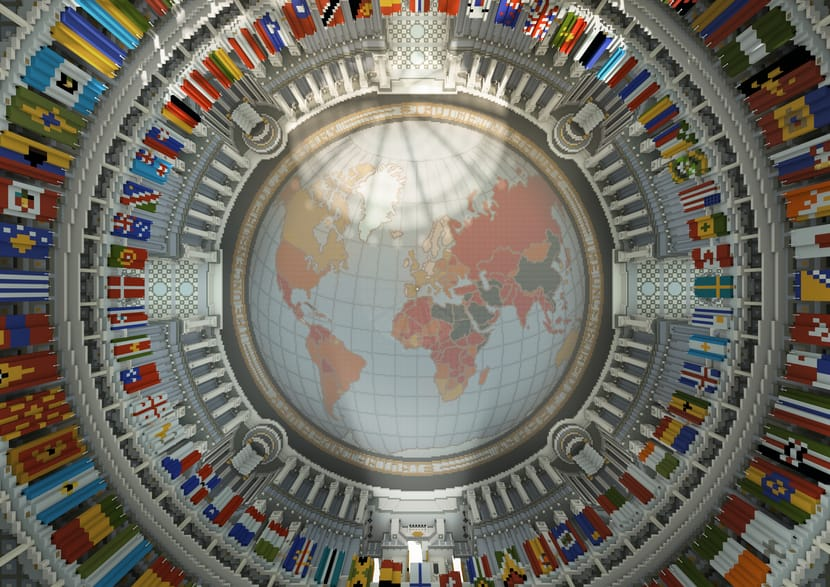

> [!summary]- Quick Summary
>
> - Modern censorship works by restricting access, not banning speech
> - The Uncensored Library publishes censored journalism inside Minecraft
> - It treats freedom of speech as a distribution problem
> - The library is designed to be visible, accessible, and copyable
>
> AI-generated summary based on the text of the article and checked by the author. [Read more](/artificial-intelligence-tools/ "BUT. Honestly Artificial Intelligence Tools") about how BUT. Honestly uses AI.

Freedom of speech survives in unexpected places because the web is no longer neutral.

For a long time, we treated the internet as if it were a level playing field. Publish something online and, in theory, anyone could reach it. Speech traveled as packets. Distribution felt automatic. Censorship looked like a legal problem, not a technical one.

That assumption no longer holds.

Today, speech is filtered, throttled, blocked, and buried by infrastructure. Websites disappear without being outlawed. Articles exist but cannot be reached. Sometimes the [[enhancing-wordpress-content-protection-beyond-right-click-blocks|infrastructure meant to protect content breaks access]]; the words are still there, but access quietly breaks.

[The Uncensored Library](https://www.uncensoredlibrary.com/en/) exists because of that shift.

## When Speech Becomes An Infrastructure Problem

Modern censorship rarely looks like book burning. It looks like DNS blocks, ISP filters, platform compliance, and automated moderation. Content is not always illegal. It is just unreachable.

This matters because freedom of speech depends on access. If people cannot reach information, the distinction between allowed and banned becomes academic.

This is the gap the Uncensored Library steps into.

Instead of fighting censorship at the level of law or platforms, the project treats it as a distribution problem. The question is not "What should be said," but "Where can words still exist?"

The answer turned out to be a video game.

## Why Minecraft

[Minecraft](https://www.minecraft.net/) is not neutral, but it is widely tolerated. It is played globally. It is used in schools. It looks like entertainment. I played it myself for many hours.

Crucially, in many countries where news sites are blocked or heavily filtered, Minecraft remains accessible—chosen for what works under real constraints. [[10-types-of-websites|Picking the right tool for the actual job]] is a pragmatism that applies to websites as much as to libraries navigating censorship.

Minecraft also has a simple mechanic that matters here: books. Players can write books with up to 100 pages. Other players can read them, but on a server the content cannot be altered.

That mechanic is enough.

The Uncensored Library does not encrypt journalism or hide it behind technical tricks. It republishes articles as Minecraft books and places them on shelves. Nothing more complicated than that.

## What The Uncensored Library Is

The library is a physical structure inside the game. It sits on a dedicated island, surrounded by water, separate from any other build. From a distance, it looks like a public institution.

The architecture is neoclassical. Columns, domes, wide staircases, long corridors. This is the visual language of courts, museums, and national libraries. The style is intentional. It signals authority and permanence, not rebellion.

The building was constructed over three months, using more than 12.5 million blocks, by 24 builders from 16 countries. The central dome spans nearly 300 meters. Scale is part of the point.

This is not a hidden archive. It is meant to be seen.

## How Information Is Arranged

You enter through a large central hall. From there, corridors branch into wings. Each wing corresponds to a country where press freedom is heavily restricted.

There is no menu. You walk.

Inside each wing are rooms lined with shelves. Each shelf holds Minecraft books. Each book contains a real journalistic article that has been censored in its country of origin. Articles appear in English and, where possible, in their original language.

You open a book and read it page by page. There is no scrolling. No search. No algorithm deciding what comes next.

The format is slow, and that is part of how it works.

## Examples, Not Abstractions

The library does not try to be exhaustive. It is illustrative.

At launch, it included journalism from five countries:

- **Egypt**, where articles from _Mada Masr_—an independent outlet blocked since 2017—can be read freely.
- **Mexico**, featuring work by **Javier Valdez**, who reported on organized crime and corruption.
- **Russia**, with articles from _grani.ru_, a site blocked in 2014, associated with **Yulia Berezovskaia**.
- **Saudi Arabia**, where articles by **Jamal Khashoggi** are available without restriction.
- **Vietnam**, including journalism by **Nguyen Van Dai**, presented in a section that incorporates a maze-like layout.

The architecture varies slightly between sections, but the content is left alone. The library does not summarize, contextualize, or editorialize. It republishes.

## Context Without Commentary

Beyond the country wings, there is a room dedicated to the World Press Freedom Index.

At its center is a globe showing press freedom conditions across 180 countries. Flags ring the space. Reports explain where access to information is restricted and where it is not.

This room does one thing well. It makes clear that the library is not about exceptions. It is about patterns.

## Access, By Design

The Uncensored Library can be visited through a public Minecraft server. Anyone with the game can connect to `visit.uncensoredlibrary.com`.

The entire world is also downloadable. Once downloaded, it can be explored offline or hosted on a private server. All books remain readable without an internet connection.

This is not a convenience feature. It is the core of the project.

Freedom of speech here does not depend on a single server, a single domain, or a single organization. The library is designed to be copied.

## What This Reveals

The Uncensored Library does not claim that games will save journalism. It shows something more specific.

When distribution channels become controlled, speech migrates. It moves into systems that were not built for publishing but still allow it. The web did not stop carrying information. It stopped being neutral about who gets to see it.

Minecraft is not special. It is simply not optimized for censorship. That is enough.

Freedom of speech does not disappear all at once.  
It erodes where access quietly fails.

Sometimes, the safest place for words is wherever infrastructure has not caught up yet.
