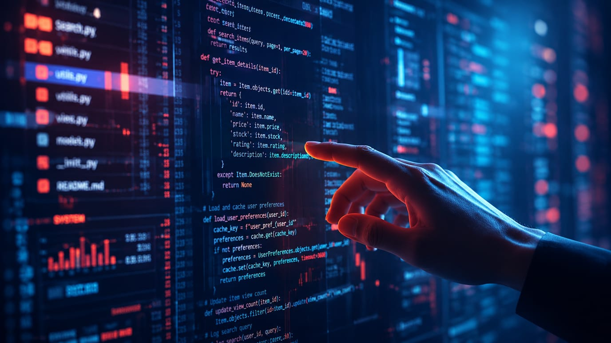

> [!summary]- Quick Summary
>
> - Vibe coding is becoming normal, but vibe writing with AI still feels suspicious, fake, or unethical to many people.
> - Code is judged by whether it runs, while writing is judged by whether it moves someone, so AI help feels riskier.
> - We care about authorship because originality still matters: the rare moments where empathy and insight combine into a new expression.
> - AI can mimic patterns and rhythm but lacks intention or meaning, so it cannot originate purpose, only language.
> - The ethical line is not in using AI, but in whether the writer keeps direction, intention, and responsibility for the words.
> - What matters most is the space we share with the machine and what we still choose to stand behind as ours.
>
> AI-generated summary based on the text of the article and checked by the author. [Read more](/artificial-intelligence-tools/ "BUT. Honestly Artificial Intelligence Tools") about how BUT. Honestly uses AI.

Why is _vibe writing_ still controversial when _vibe coding_ is already becoming normal?

Earlier this month, I wrote about [[what-is-vibe-coding-how-to-do-it|vibe coding]], the idea of building software by describing how it should _feel_ rather than how it should work. The concept is spreading fast: developers are experimenting with it, companies are hiring people around it, and tools are being built for it.

Yet when writers do the same thing, when they co-write with AI based on tone, rhythm, and intuition, it’s often dismissed as fake, lazy, or unethical.

We’ve accepted vibe coding as creative collaboration, but _vibe writing_ still feels like a moral shortcut. Why?

## What’s a Vibe, Anyway?

When did a feeling become something you could program?

What started as a playful way to talk about intuition in design is now shaping how software gets built. Vibe coding isn’t about control; it’s about collaboration with the machine. You describe the atmosphere of what you want — “make it feel faster,” “make it a bit warmer,” “make it look alive” — and tools like Cursor, Replit, and Telex turn that into working code.

It’s a strange but natural evolution. As AI systems take over syntax and structure, human work shifts toward sense. Developers focus less on getting the function right and more on getting the feeling right. Some have started using [the term VibeOps](https://ezops.cloud/blog/vibeops-devops-future) to define people who write code by vibe coding, describing how software should feel instead of detailing how it should work internally.

In that world, “feel” becomes an interface. And that raises an obvious question: if we can code by vibe, why can’t we write by it, make art by it, or make music by it? But let’s stick to writing for now.

## When Vibes Write Instead of Code

If vibe coding is about building through intuition, vibe writing is about expressing through it. I use the term loosely; it isn’t established, at least not yet. But it captures something real: the growing habit of co-writing with AI tools, where tone, rhythm, and feel guide the process as much as structure or logic.

When a developer co-creates with AI, it’s considered efficient. When a writer does the same, it’s often seen as lazy or fake. Why does an algorithm refactoring code feel productive, but an algorithm suggesting sentences feel dishonest?

Maybe it’s because code is already collective. It’s meant to be shared, merged, forked, and reused. Writing isn’t. We still think of it as personal, a reflection of voice and identity. Code is measured by whether it runs; writing is measured by whether it moves.

That difference changes everything. When AI helps with code, it enhances performance. When it helps with writing, it questions authorship.

> “Code is measured by whether it runs; writing is measured by whether it moves.”

But under the surface, both acts are about the same thing: translation. Turning intention into something that works, that feels right. One just happens to end in logic, the other in language.

Still, I keep wondering where we draw the line. Is a chatbot writing support replies a writer? What about when it creates documentation, or marketing copy, or onboarding emails? We rarely think twice about those, but when it comes to essays, books, or blogs, everything changes. Why?

Maybe what we’re defending isn’t writing itself, but the illusion that certain words are more important than others and must come from a person.

## The Different Ethics of Creation

When AI assists in code, we call it productivity. When it assists in writing, we call it plagiarism.

Why? Perhaps it’s because code has clear success metrics. It runs, or it doesn’t. Writing doesn’t work like that. Its success isn’t measured by output but by impact, by whether it moves someone. And that impact is still considered uniquely human.

But what happens when vibe writing does move someone? If a piece of text makes you feel something, does it matter who, or what, wrote it?

## The Illusion of Originality

Maybe it does. Not because of pride or ownership, but because originality still means something. We care about who writes because we care about how ideas are born, how they move from a thought into something that changes us.

We like to say there’s nothing new under the sun. Possibly that’s true most of the time. Most writing, like most code, is incremental. We build on what already exists, what we’ve seen, read, or felt before. Creation has always been a kind of collaboration across time.

But that doesn’t mean originality is an illusion. It’s just rare. Every so often, someone manages to think or express something that nobody else has. Not because they worked in isolation, but because they saw something others didn’t. That spark of perspective, that leap, is what we call originality.

In that sense, originality isn’t the absence of influence. It’s what happens when empathy meets insight. When someone feels something deeply enough to find a new way to express it.

Machines can imitate our patterns, but they don’t know what any of it means. They can shape language, but not intention. They can build rhythm, but not resonance. Originality comes from purpose, from wanting to say something because it matters.

## Where We Draw the Line

Maybe the real question isn’t what AI can do, but what we still want to do ourselves.

There’s a difference between using a tool and sharing authorship. Between asking for help and giving up direction. That’s the thin line vibe writing keeps tracing, somewhere between collaboration and surrender.

I don’t think ethics will come from rules. They’ll come from practice, from the way we choose to use these systems. Some writers will lean on them for speed; others will use them to think. Some will refuse them entirely. Over time, that mix will shape what we call fair, or human, or original.

What matters is intention. If writing is about expression, then the question isn’t whether a machine helped, it’s whether the writer still meant what was said.

Maybe that’s where the line is. Not in the tools we use, but in the meaning we stand behind.

---

_I should probably mention how this essay came together._

_I wrote it in conversation with ChatGPT. Not as a co-author, but as a partner I could question and refine. The process looked more like editing in real time than automation._

_It started with an outline. I asked ChatGPT to help shape the structure, suggest sections, and test how the argument could flow from “vibe coding” to “vibe writing.” I challenged its first drafts, trimmed repetition, and rewrote phrasing that didn’t sound like me or that I did not believe. When I wasn’t sure about a term, I asked it to research usage and examples. We checked whether “VibeOps” was a real thing. I asked GPT to find sources about the facts that we were stating._

_But most of the work wasn’t about structure, it was about ideas. We argued over what originality means, whether empathy defines human creativity, and why certain forms of writing still feel off-limits. Sometimes I disagreed with its reasoning; other times, it challenged mine. Those exchanges shaped this essay more than any outline._

_That’s what vibe writing meant here, using the tool as a space to think, not as a shortcut. The AI helped me build momentum, but it never decided what to say. Every sentence, every turn of thought, was filtered through my questions and beliefs. Every choice, rhythm, and pause was mine._

---

## The Space We Share

Writing with AI didn’t just shape this essay. It shaped how I think about creation itself.

Maybe that’s the point of all this. The goal isn’t to prove who’s more original, human or machine, but to stay aware of what makes creation meaningful.

Writing this essay challenged a few of my own assumptions and beliefs. It made me see where I actually stand on vibe writing, vibe coding, and originality. I started out curious, maybe a bit skeptical, but somewhere along the way I realized that what matters most to me isn’t authorship or speed, it’s intention. Why we create, and what we hope others will feel when they read it.

I didn’t write this to defend vibe writing or to reject it. I wrote it to understand where feeling ends and language begins, and what happens when that space is shared.

What do you think? Would you ever call this kind of writing your own?
