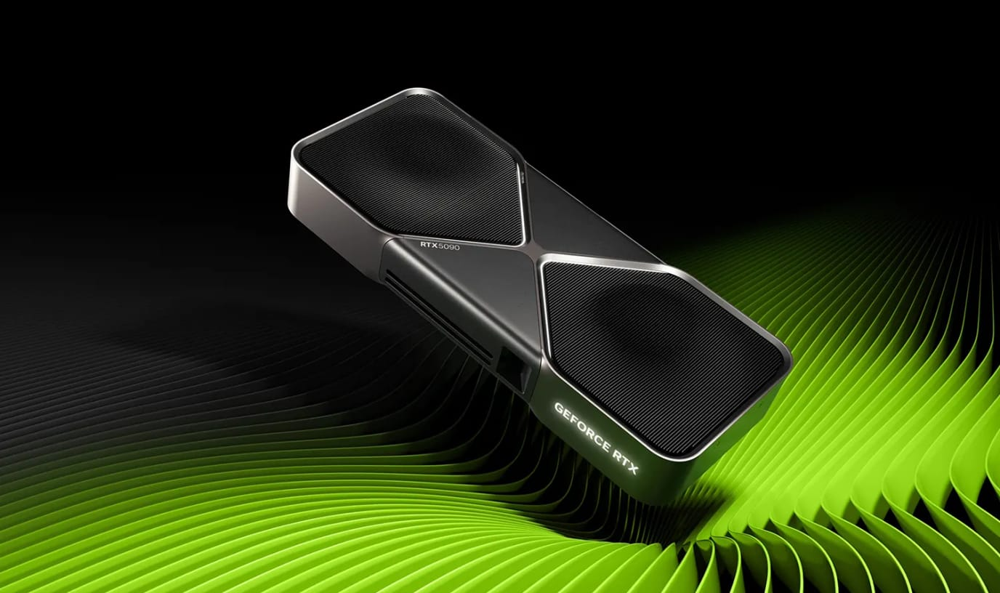
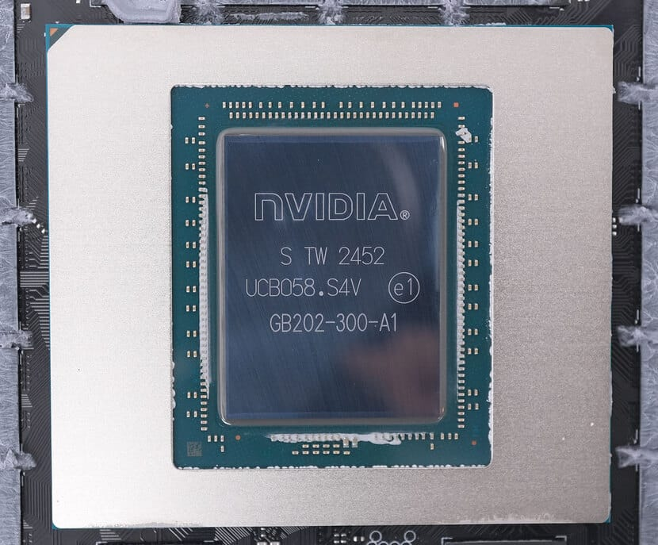
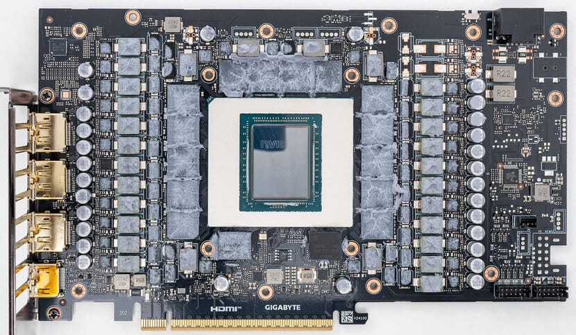
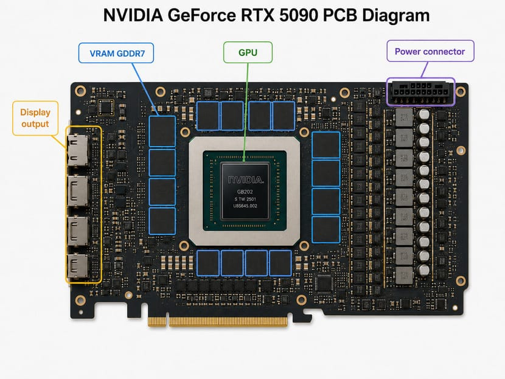
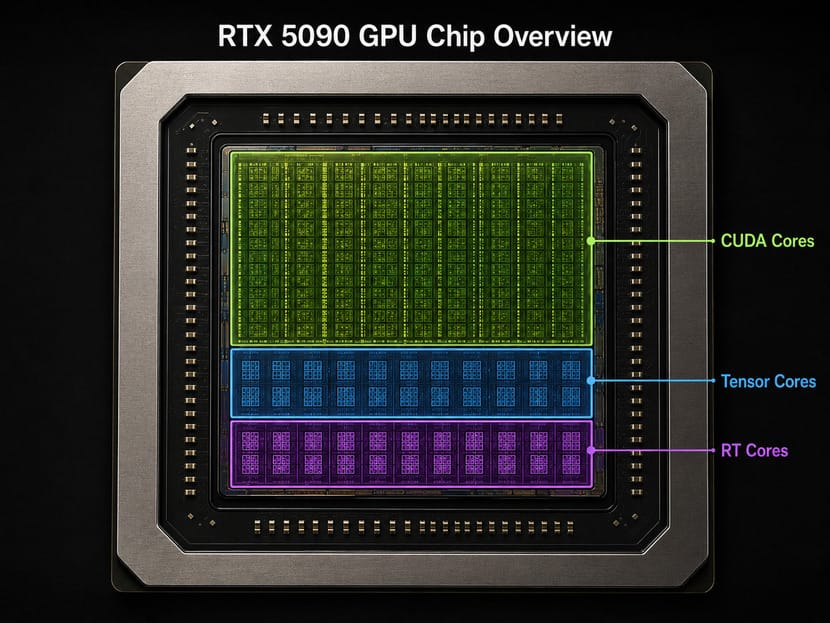
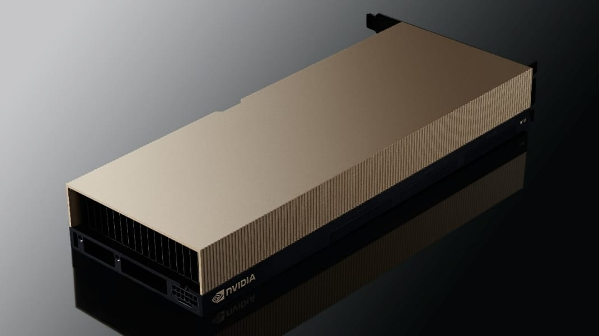

> [!summary]- Quick Summary
>
> - A GPU is the chip inside a graphics card, not the whole card.
> - GPUs are useful for AI because they run thousands of small calculations in parallel.
> - That matches how neural networks work: lots of matrix math, repeated at scale.
> - For AI, VRAM, memory bandwidth, Tensor cores, and software support matter more than gaming performance.
> - The real story is not the card on the shelf, but the chip inside it and the stack built around it.
>
> AI-generated summary based on the text of the article and checked by the author. [Read more](/artificial-intelligence-tools/ "BUT. Honestly Artificial Intelligence Tools") about how BUT. Honestly uses AI.

I trained AI models on an RTX 3090 before I realized I was using the word _GPU_ wrong.

I kept bouncing between machines: a MacBook Pro M3, a desktop with one RTX 3090, then two in parallel, then Google Colab when nothing else was enough. The surprise was how unpredictable the trade-offs were. Some [[neural-network-predict-resin-usage-3d-printed-miniatures|models I'd built locally]] ran fine on the Mac. Others I expected to fly on the desktop ran out of memory before they got started. When the desktop choked, sometimes the Mac picked it up. When the Mac couldn't load the weights, the 3090s did fine.

The whole time, I called the 3090 my GPU. Most people do. But that's the card — the whole assembly that bolts into a PCIe slot. The GPU is one chip on that card. On the 3090 it's the GA102. On the 5090 it's the GB202. On the H100 sitting in OpenAI's data centers, it's the GH100. Different chips, different names. And the trade-offs I kept tripping over weren't really between cards. They were between chips, and how each one handles memory.

## Graphics Card vs. GPU

A graphics card is the whole assembly — circuit board, memory chips, power regulation, cooling, the physical connectors that plug into your monitor. It bolts into a PCIe slot on your motherboard and behaves like its own small computer. Most modern desktops have one. Most laptops don't, relying instead on the integrated graphics that ship inside the CPU.

When someone says "NVIDIA GeForce RTX 5090" or "AMD Radeon RX 9060 XT," they're naming the card.

The GPU is one chip on that card. A microchip soldered onto the PCB (Printed Circuit Board) alongside the memory, the voltage regulators, and dozens of other components. NVIDIA calls the GPU on the RTX 5090 the **GB202**. AMD calls the one on the RX 9060 XT **Navi 44**. The chip is what does the actual computation. The card is what makes the chip usable.

Below: two images by _W1zzard on techpowerup.com_: the GB202 chip itself, and the PCB it sits on in an RTX 5090. The chip is the small square in the middle of the board; everything else around it is what the card adds.

  
  

## What's Inside a Graphics Card?

Now that the chip-and-card distinction is clear, let's look at what else lives on the PCB.

Below is an annotated diagram of an RTX 5090 PCB. Not every component is marked. The actual board has many more, but these are the ones worth knowing.

#### Display Output

The display output lets you connect the card to a monitor. Most cards have at least one, usually HDMI or DisplayPort. Some don't. Not every graphics card is meant to drive a screen, which is the first hint that AI cards play by different rules. More on that later.

#### Power Connector

The power connector is exactly what it sounds like. Modern cards draw enough power that the PCIe slot alone can't feed them. A high-end card like the 5090 has a 575W TDP, more than most CPUs. So they get a dedicated cable from the power supply. Without it, the card doesn't function. Some systems boot to a warning, others refuse to start at all.

#### VRAM

VRAM is video memory, the GPU's dedicated RAM. It works like the regular DDR4 or DDR5 sticks in your computer, but tuned for different work. Regular RAM is used by the CPU for fast, latency-sensitive operations. VRAM is used by the GPU for moving large chunks of data at once.

The trade-off is bandwidth versus latency. VRAM (GDDR6, GDDR7, and so on) is built to transfer enormous amounts of information per second. Each individual access is slower than a DDR5 access would be, but the volume is far higher. It sits physically next to the GPU on the PCB so the chip can reach it as fast as possible. Every nanosecond of distance matters at these speeds.

#### GPU

The GPU is the chip that does the actual graphics work. It looks like a CPU at first glance, with the same silicon die, solder pads, and heat-spreader on top. But the architecture inside is different. A CPU is built for a few fast, sequential, complex operations at a time. A GPU is built for thousands of simple operations running in parallel.

That difference is what makes GPUs useful for graphics, and, as we'll see, for AI.

## GPU vs. CPU

If you've shopped for a CPU or graphics card, you've heard of cores. The folk wisdom is that more is better. That's not quite right, and the reason matters.

A CPU generally has between 4 and 24 cores, depending on whether we're talking about a laptop, a desktop, or a high-end workstation.

A GPU has thousands. The RTX 5090 has 22,610 cores in total — roughly 940 times what a top-end desktop CPU offers. The obvious question: how is the CPU not obsolete?

The answer is that GPU cores aren't doing the same kind of work. They're smaller, simpler, and split into different types, each built for a specific job. NVIDIA and AMD use different names for them, but the categories line up. I'll use NVIDIA's names, since that's what most people will see on a spec sheet.

1. **CUDA cores.** General-purpose processors that handle the bulk of GPU work: 3D rendering, physics, shading, and the math behind most graphics. They make up the vast majority of cores on the chip. The RTX 5090 has 21,760 of these.
2. **Tensor cores.** Purpose-built hardware for matrix math. They're what makes the chip useful for AI workloads, because neural network training is, at the bottom, matrix multiplication at enormous scale. The RTX 5090 has 680 of them.
3. **RT cores.** Built to accelerate the math behind ray tracing. The RTX 5090 has 170 — fewer than the Tensor cores, but still doing a specialized job that the CUDA cores would handle far more slowly.

Add them up: 21,760 + 680 + 170 = 22,610. All of them live on the same GPU chip.

> [!info]
> **Ray tracing, briefly.** It simulates how light actually behaves: rays from a source bounce off surfaces, refract, get absorbed, and produce realistic reflections, shadows, and indirect lighting. Traditional rendering fakes these effects with cheaper approximations. Ray tracing computes them honestly, frame by frame. It's expensive math, which is why GPUs ship dedicated RT cores.

Each type would do badly at what a CPU does. Running an operating system, juggling browser tabs, handling complex branching logic, switching contexts: these are CPU jobs. CPU cores are big and complicated because they need to do them well. GPU cores are designed for the opposite case: a huge number of small, repetitive tasks running at the same time. To simplify, they take calculations from the CPU and decide which pixels on a monitor should turn on and what color each should be.

## Why Are GPUs Good for AI?

GPUs were built to figure out which pixels to turn on and what color to paint them. That work involves millions of small, independent calculations per frame. It happens to be a perfect rehearsal for something else entirely.

A neural network is, at its core, a stack of matrix multiplications. Inputs go in, get multiplied by weights, summed, passed through a function, repeat. Training one means doing this trillions of times across a dataset. Each multiplication is small. The volume is gigantic. Sound familiar?

The hinge moment was 2012. Alex Krizhevsky, Ilya Sutskever, and Geoffrey Hinton trained a network called AlexNet on a pair of GeForce GTX 580 cards. It demolished the ImageNet competition by a wide margin. Work that had taken weeks on CPUs now took days on consumer gaming hardware. It's not an overstatement to say that everything in modern AI traces back to that result.

After AlexNet, the industry realized GPUs weren't just useful for graphics. They were the right tool for any workload built on matrix math at scale. Which turns out to be most of machine learning. From [[building-convolutional-neural-network-python-tensorflow|my own small CNN experiments]] on a single 3090, up to the cluster-scale training runs at OpenAI and Anthropic, the underlying compute is the same shape. Just more of it.

NVIDIA responded by building cards purpose-built for that work. No display outputs. No fans, because they expect rack-level cooling. Designed to be linked to dozens of identical cards on the same node, behaving as a single computational unit. Meant for server racks, not desktops.

The NVIDIA H100 is the best-known example.

The spec sheet looks different from a consumer card. Instead of the 32 GB of GDDR7 on an RTX 5090, the H100 has 80 GB of HBM3. That's a faster, more expensive memory technology used almost exclusively in data-center hardware. The GH100 chip inside it has 14,592 CUDA cores, fewer than the 5090's 21,760, but it makes up for that in Tensor core throughput and raw bandwidth. Memory bandwidth on the SXM variant tops 3.35 TB/s, almost double what the 5090 can move.

These numbers exist because training large models means shoveling enormous amounts of data through the chip. More VRAM means a bigger model can fit. More bandwidth means the chip doesn't sit idle waiting for the next batch. Both matter more for AI than they do for gaming.

There's a distinction worth naming here: **training** versus **inference**. Training is what builds a model. It runs billions of examples through the network and adjusts the weights. That's the part that needs huge VRAM and brutal compute. Inference is what happens after training, when the model is used: an answer for one prompt, a label for one image. Inference is cheaper. It's why a model trained on thousands of H100s can run on a single laptop, just more slowly.

This is roughly where adding a second 3090 to my desktop came in. The first card was enough for inference and for fine-tuning small models. The second one let me train on more data without spilling to disk every few seconds. Two consumer cards aren't an H100, but they're enough for hobby-scale work. Most of what I've published runs at that scale.

## The Real Moat Is Software

Hardware is half the story. The other half is the stack that makes it usable.

NVIDIA has spent nearly twenty years building that stack. **CUDA**, their parallel-computing platform, launched in 2007. It let developers write general-purpose programs that ran on the GPU, instead of treating the GPU as a black box that only knew how to draw triangles. Every major deep-learning framework (PyTorch, TensorFlow, JAX) has CUDA support as a first-class citizen. Most ship with it as the default.

AMD has had a competing platform, **ROCm**, since 2016. The hardware is genuinely competitive on paper. The software is not. ROCm is mostly Linux-only. Model coverage is narrower, tooling is patchier, and most of the prebuilt containers, tutorials, and Stack Overflow answers assume NVIDIA. If you've ever spent a Saturday afternoon trying to get [[set-up-tensorflow-docker-jupyter-notebook|CUDA, drivers, and Python versions to agree]], you've experienced the easy version of this problem. The AMD equivalent is worse.

This is why the comparison between cards isn't only about TFLOPS. Drivers and runtime libraries decide how much of that hardware you can actually use. An older NVIDIA card on a recent CUDA release will often outpace a newer AMD card running an unsupported configuration.

The same logic runs in reverse. Run Pac-Man on an RTX 5090 and expect the card to make the game look better. It won't. The software is at its peak, and no amount of hardware below it changes what the player sees. The chip is only as good as the stack pointing instructions at it.

## Buying for Gaming vs. Buying for AI

Once you stop conflating the card with the chip, the buying question gets simpler. You're really choosing between two different problems.

**For gaming**, the trade-offs are about getting frames on the screen at the resolution and quality you want. The numbers worth weighing are VRAM (enough to handle your resolution), raster performance for the games you play, and RT core count if ray-traced lighting matters to you. Both major brands compete here, and at most price points one or the other will be ahead by a small margin. Brand loyalty matters less than people pretend.

**For AI work**, the picture changes. You're not driving a screen. You're moving large blocks of data in and out of memory and grinding through matrix math. VRAM moves to the top of the list, because the size of the model you can train or run depends on it. Memory bandwidth comes next, because the chip sits idle if it can't feed itself fast enough. Tensor core count follows, since those are the units doing the actual AI math.

The software side narrows the field. As covered in the last section, NVIDIA's CUDA platform is where almost every AI framework lives. Going outside that ecosystem means more work to get the same job done. If your goal is to learn, build, and ship without fighting tooling, that decision is mostly made for you.

There's a third path I've used: Apple Silicon. The trick is unified memory. On a Mac with an M-series chip, the GPU and CPU share the same memory pool. There's no separate VRAM with its own ceiling. A Mac with enough system RAM can sometimes load models that won't fit on a desktop card with much faster compute. The trade-off is speed: a Mac will train slower than a dedicated GPU, and not every framework supports its Metal backend cleanly. But for inference and for fitting larger models locally, it's a real option. The [[distilroberta-emotion-analysis-nlp-case-study|NLP analysis I ran on Steam reviews]] is the kind of work where memory ceiling matters more than raw speed.

The blunt summary: pick what serves the work. A gaming card built for frames per second is the wrong tool for training, and a card stripped of display outputs is the wrong tool for gaming. They're built for different problems. The price reflects that.

## Why Have Graphics Cards Gotten So Expensive?

Card prices have climbed sharply over the last several years. AI is the current driver, but the story started earlier with crypto mining.

GPUs turned out to be excellent at the math behind proof-of-work mining. Same advantage as before: thousands of small cores running the same operation in parallel, except now the operation is hashing instead of matrix math. When Bitcoin became valuable and other coins like Ethereum followed, miners started buying consumer GPUs by the rack. The Ethereum booms of 2017–2018 and 2020–2021 each [pulled cards off shelves faster than they could be made](https://www.digitaltrends.com/computing/catastrophic-gpu-shortage-a-chronological-history/). Prices doubled or tripled on the secondary market. Gamers couldn't find stock at MSRP for months at a time.

That cooled down in 2022 when Ethereum moved off proof-of-work and mining stopped being profitable on consumer cards. For a few months it looked like the market might normalize. Then ChatGPT launched, AI demand exploded, and the gap closed quickly.

The simple version of the AI shock: consumer GPUs got good enough to be useful for AI work that isn't quite at the frontier. A high-end consumer card can fine-tune a small or mid-sized model, run inference on something larger, or train a custom network from scratch if the dataset isn't enormous. It can't train a frontier large language model from scratch. That's still the realm of clusters of data-center cards. But for almost anything below that scale, a consumer card is enough.

That created a second, overlapping demand pool. The market used to be gamers, professional 3D artists, and a small number of researchers. It's now also AI hobbyists, indie developers, small startups, and labs that can't afford an H100 setup. Two groups bidding on the same hardware tends to push prices up.

Supply did not keep pace. Manufacturing capacity for high-end GPU chips is concentrated at a handful of foundries, mostly TSMC. The same fabs producing consumer GPUs are also producing data-center accelerators and the latest CPU dies for everyone else. When AI demand spiked on top of the existing shortage, the constraint was wafer supply, and consumer cards had to compete for the same finite output.

The result is a market where the gap between gaming-tier and data-center-tier prices has compressed at the top. A flagship consumer card now costs in the low four figures at launch. That's far more than a comparable flagship cost a decade ago, even adjusting for inflation. Data-center cards still cost an order of magnitude more, but the line between "expensive hobby" and "serious infrastructure" has thinned.

There's an honest limit to put on the hobbyist case. You can do a lot of real AI work on a single consumer card. You cannot recreate ChatGPT in your bedroom. The frontier models trained today use thousands of data-center GPUs running in coordinated parallel for weeks or months. A consumer card is a useful entry point. It isn't a substitute for that scale of compute.

## What You're Actually Holding

When I first looked into which chip was in my desktop, I expected a clean answer. The 3090, obviously. That's what NVIDIA's marketing said. That's what the reviews compared. That's what the box on the shelf was labeled. The truth was stranger. The card was a 3090, but the GPU was the GA102. The GA102 also lived in the 3080, the 3080 Ti, the A6000, and a handful of professional cards I'd never heard of. One chip, several products, depending on which cores were enabled and which memory was attached.

The chip is the actual unit of work. It gets manufactured at TSMC and parceled out across NVIDIA's product lines. From there it's sold to consumers and data centers, and fought over by every research lab trying to build the next model. The card is the packaging. The chip is the resource.

That changes how the news reads. When someone says NVIDIA shipped a million H100s last quarter, that's a story about the GH100 chip. When export controls limit GPU sales to a country, the rule isn't about cards. It's written around the chips, with specific performance thresholds spelled out in the regulation. When OpenAI announces a new training run, what they actually bought was a few thousand specific chips that NVIDIA couldn't produce fast enough.

None of that changes what's on your desk. The card still bolts into the same slot, the fans still spin the same way. But the next time a headline mentions an AI lab buying compute, or export controls, or a price spike that doesn't quite explain itself, you'll know where to look. Not at the card. At the chip inside it, and at the small list of people who can make them. The chip is also where the limits live: [[limits-of-machine-learning|what AI can do, what it can't, and where it's headed]].
