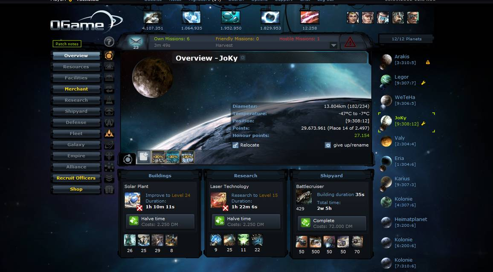
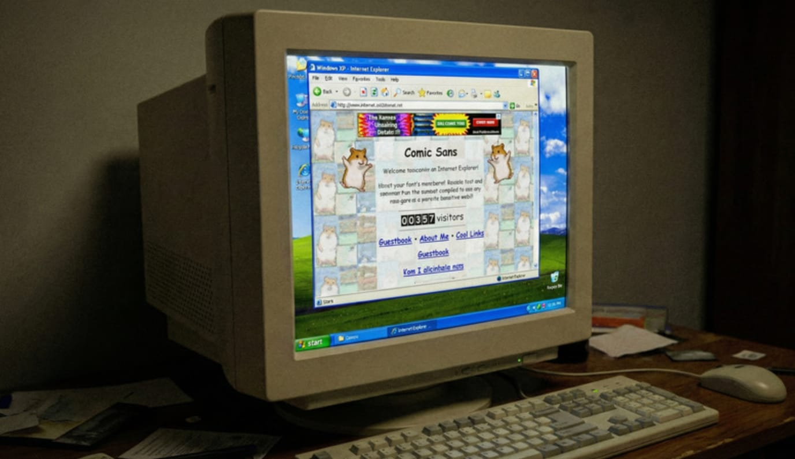

> [!summary]- Quick Summary
>
> - I became a web developer before AI by rebuilding a stranger’s website from “view source”, breaking layouts, and learning from other people’s code.
> - If you want to get into web development now, focus on core skills first: TypeScript, PHP, Python, CSS, then add frameworks like React, Next.js, Laravel, or Django.
> - There’s no fixed answer to how long it takes to become a web developer; it depends on consistent practice and real projects.
> - AI and vibe coding can speed you up, but only if you question every answer and rebuild things yourself until you truly understand them.
>
> AI-generated summary based on the text of the article and checked by the author. [Read more](/artificial-intelligence-tools/ "BUT. Honestly Artificial Intelligence Tools") about how BUT. Honestly uses AI.

I didn’t become a web developer by following a roadmap.

There was no “Front-End in 100 Days” challenge. No YouTube crash courses. No AI agent sitting in my editor, finishing my thoughts.

There was a browser game, a stranger’s personal website, and a lot of code I didn’t understand.

This is what becoming a web developer looked like before AI, YouTube, and gamified courses.

## Before I Knew What a Developer Was

As a kid, I had no idea what a _developer_ was.

I only knew computers as boxes you could open and fix. I “worked” in the shop of a family friend, putting together machines from parts, formatting hard drives, reinstalling Windows, and solving the usual “my PC is broken” problems.

It felt like being a mechanic. I understood how to make a broken machine work again, but not how to make it do anything new.

That changed in my first year of high school, in 2005, when I finally convinced my parents to get internet at home.

### Forums, OGame, and a Ministry Job

My first question with internet access wasn’t “W*hat is a web developer*?”

It was closer to: “Where can I play games with my friends?”

I ended up on gaming forums. Long threads. Bad signatures. Arguments about strategies that didn’t matter at all in real life.

A classmate introduced me to OGame, a browser-based RTS game where you built planets, launched fleets, and waited hours for attacks to land.

It all ran in the browser. No downloads, no installers. Just a URL and a login form. That alone felt like magic.



Inside OGame, I joined a massive alliance called DEFAL. It ran like a small, chaotic country. We had ministries, a constitution, laws, and hearings. The founder was very into politics and basically turned the alliance into a role-play parliament.

I climbed the ladder. I became a forum moderator. Then “Ministry of Commerce.”

These roles were fake. The time spent reading and writing on that forum wasn’t. What does this have all to do with becoming a web developer?

### The First Personal Website That Hooked Me

In that alliance there was one player who stood out, and not because of his rank.

He had a personal website he built himself.

At the time, this was not so rare, but I knew nobody personally who did that and to whom I could talk.

His site was full of posts about things I barely understood: physics, philosophy, and technical ideas that went over my head. I didn’t get the content, but I loved that he had a place that was his.

I wanted that too.

So I asked him where I could learn.

He pointed me to HTML.it, an Italian site packed with free tutorials on XHTML, CSS, and the basics of _web development_. That became my first real classroom.



## Rebuilding A Website From “View Source”

I started with “View Source.”

I opened his homepage in the browser, right-clicked, and stared at the HTML. Line after line of tags and attributes I didn’t understand yet. Somewhere in there was the structure that turned into his layout.

I noticed something called a `div`.

It seemed to wrap other elements. So I took a small section of his code, went back to HTML.it, and searched, “What is a div tag?” I read an explanation, tried to connect it to what I was seeing, and then tried it on my page.

I rebuilt his layout piece by piece:

- Add a `div`
- Refresh the page
- See where it lands
- Adjust something
- Refresh again

Then I found the CSS.

I saw how classes were used to style those `div`s. I copied just enough to experiment. I changed a value. The layout moved. I changed another one. The page broke. Back to tutorials.

Centering a `div` became a miniature boss fight.

I struggled with `margin`, `padding`, `width`, and everything else. I kept searching, reading, and refreshing until that box finally sat in the middle of the page where I wanted it.

That moment, seeing something appear exactly where _I_ told it to, was the hook.

I hosted my version of the site on a free Italian provider with a tiny storage limit. I didn’t care. It was mine. Also, it’s not like I could afford to pay for a better one anyway. I had my 200 megabytes of space (database included), and I had to get the best out of it.

My ally had made his website’s source code open-source and available to download. Obviously I got it. I opened the zip and I realized something important: his files weren’t `.html` at all.

They were `.php`.

## When HTML Turned Into PHP

Opening his files was like opening a watch and seeing gears spinning in strange directions.

Functions. Classes. Odd symbols. No static content. No handwritten posts. Just logic.

Where was the text coming from? How was the page built? How did all these PHP files work together?

That confusion pushed me into programming.


I started with simple, linear PHP scripts. One file, top to bottom: print some text, maybe read something from a database with no concerns about security, perhaps show a variable. Nothing you’d put in a “jobs for web developers” ad, but enough to feel like I was finally talking to the server, not just the browser.

Then I discovered Joomla.

## Learning From Other People’s Code

Joomla was a popular content management system at the time.

Its codebase was a maze: classes calling other classes, functions layered on top of each other, configuration files for everything, and queries going to MySQL.

I learned object-oriented programming by trying to understand how Joomla worked.

I traced function calls. I followed how a request went from a URL to a controller to a view. I looked at how templates were structured and how data reached them. I didn’t have the vocabulary for most of it yet, but I could see patterns repeat.

This was my definition of “_what is web development_” back then:

- There is a request
- There is some logic
- There is a response
- Everything in the middle is worth understanding

None of this came from school.

## School, But Slower Than The Internet

In high school, from the 3rd to 5th year, we were learning HTML4 without CSS. Remember, it was between 2007 and 2010. XHTML 1.0 had been recommended by W3C since the year 2000. Meanwhile, I was still learning how to make websites with tables and `font` attributes on everything.

We were also learning PHP. One example of what our professor was trying to teach us looked like this:

```php
$a = 4;
$b = 5;
echo $a + $b;
```

Useful for the first week. Not for the whole year.

My classmates were moving slowly, so the teacher couldn’t go faster. We never got close to building a full website or app. Meanwhile, at home, I was reading tutorials on:

- CSS layouts
- PHP and MySQL
- Basic JavaScript
- How to tweak Joomla and other systems

Most of my progress came from this loop:

Try → break → read → fix → repeat.

By the time I finished high school, I had built some small sites for local companies and plugins for forums. They weren’t good, but they were real. I’d accidentally answered “how to become a web developer” by just… doing web development… for fun.

## From Local Sites To Real Products

Eventually I found an Italian blog called Your Inspiration Web.

It covered WordPress, design, and web development. I started as a reader. Then I became a writer. My old articles are still there in the archive.

They saw my work and offered me a position for a separate project they were working on. I did not know WordPress yet. I downloaded a free Photoshop theme layout and rebuilt it in code to make it work with WordPress. I got the job and started working with Your Inspiration Themes. The team later became YIThemes, and it’s today known as YITH for WooCommerce themes and plugins.

There I learned:

- How to structure PHP beyond quick scripts
- How WordPress actually works under the hood
- How to build themes and support real users
- How to think about performance, not just features

I rewrote my personal site on WordPress, kept experimenting, and shipped code that powered real shops.

That’s where “I tinker with code” turned into “I’m a web developer”, even if I didn’t say it out loud yet.

## So… What Is a Web Developer?

Under all the titles and stacks, a web developer is someone who understands how to make ideas work on the web.

If you strip it down, web development looks like this:

- A browser sends a request
- A server responds with something useful
- You design and control what happens in between

Whether you call yourself front-end, back-end, or full stack, you’re still playing in that space.

When people search _“What is a web developer_” or “W*hat is web development*”, the real answer is more practical than most definitions:

You understand the browser.  
You understand the server.  
You can connect the two in a way that solves a real problem.

Everything else is tooling.

## What a New Web Developer Should Learn First

If you’re wondering how to become a web developer today, you already have more tools than I did. That’s good and dangerous at the same time.

You don’t need to learn everything, but you do need a solid base.

> _”Learn the basics deeply, then add frameworks with a purpose”._

### TypeScript and Modern JavaScript

This is the language of modern web apps.

TypeScript gives you structure and safety. You’ll see it in:

- React
- Next.js
- Node-based backends

If you want web developer jobs in front-end or full-stack work, TypeScript is difficult to avoid.

### PHP

PHP is not trendy, but it’s everywhere. You’ll read online that PHP is dead, but [it powers 72.9% of all websites](https://w3techs.com/technologies/history_overview/programming_language). This is only a myth that has existed since I can remember.

WordPress is built with PHP, and it powers a massive slice of the internet ([43.2% as of today](https://w3techs.com/technologies/overview/content_management)). Many real businesses depend on it.

Knowing PHP lets you:

- Work with WordPress and WooCommerce
- Maintain classic server-rendered sites
- Understand many existing codebases

If you’re looking at jobs for web developers that involve content sites, agencies, or e-commerce, PHP is still very relevant.

### CSS

Not just Tailwind. CSS itself.

If you know CSS, you can:

- Control layout, spacing, and typography
- Fix broken layouts without guessing
- Make things look intentional, not accidental

Once you understand CSS, utility frameworks become accelerators instead of crutches.

### Frameworks On Top

After the basics, pick frameworks that match the kind of projects you want to build:

- React or Next.js for front-end and full-stack JavaScript
- Laravel for expressive PHP backends
- Tailwind once your CSS fundamentals are solid

This is one honest answer to how to become a web developer: learn the basics deeply, then add frameworks with a purpose.

## What Web Developer Jobs Actually Look Like

When people google “web developer jobs”, they usually imagine one thing: sitting in front of a laptop writing JavaScript eight hours a day. Real jobs for web developers are messier and more varied than that.

In my case, it started with tiny sites for local companies, support work for WordPress themes, and plugins that solved very specific problems in WooCommerce shops.

Your path might look like:

- joining an agency that ships many small client sites,
- working on an internal company tool,
- freelancing on WordPress, Shopify, or custom web apps, or
- contributing to a SaaS product with a long life.

All of these are web developer jobs. The common thread is that you understand the browser, the server, and how to connect them in a way that keeps a real business running.

## How Long Does It Take To Become a Web Developer?

People love asking this question.

They want “six months” or “a year” or some other clean number. In practice, how long it takes to become a web developer depends on a few things:

- How much time you can spend each week
- Whether you’re building real projects or just consuming content
- How comfortable you are being confused for long stretches

You can get your first small freelance work in under a year if you’re consistent. It might take longer to feel confident. That’s fine.

What matters is that you’re moving in the right direction: from “I can follow tutorials” to “I can build something from scratch and debug it when it breaks.”

## Using AI Without Letting It Think For You

Now we get to AI.

Today, you can sit down with ChatGPT or another model, describe an app in plain language, and get back a working prototype. You can [[what-is-vibe-coding-how-to-do-it|vibe code your way through features]] without touching a tutorial. [[wordpress-blocks-telex|Even in WordPress]].

That’s powerful. It’s also risky.

If you treat AI like a black box that magically produces correct code, you’re borrowing understanding you don’t own. The moment something breaks in production, you’re stuck.

But if you want to grow as a developer, you can’t stop at “the AI says it works.”

Use AI like this instead:

- Ask it to generate code, then read every line
- Ask _why_ it chose that approach
- Compare it with official documentation
- Try to rewrite the same feature on your own

One good habit is to build a project with AI, ship it, then rebuild it from scratch without AI, using only docs and search. The second version will be slower to write but faster to understand.

AI should compress time, not replace thinking.


Once you know how things work, AI becomes a multiplier. It can help you ship faster, explore more ideas, and avoid some dead ends. But the foundation is still yours.

## Am I Still a Web Developer?

I’d lie if I said yes. I moved on to [coaching and leadership](/section/leadership/ "Leadership"), I still code, but [[neural-network-predict-resin-usage-3d-printed-miniatures|mostly in Python for machine learning]], rarely in PHP or for the web.

The tools I used when I started—HTML.it, Joomla, early WordPress, random forums—look old now.

Yours will be different. You’ll have modern frameworks, powerful editors, and AI that would have felt like science fiction back then.

But the core doesn’t change. I still use today those basic concept I learned 20 years ago:

You look at something you don’t understand.  
You stay with it until you do.  
Then you build the next thing.

Tools change. Attention and curiosity don’t.
