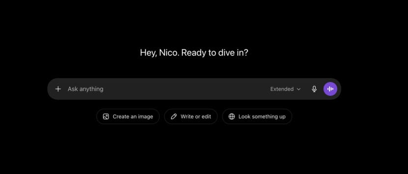

> [!summary]- Quick Summary
>
> - I came back from sabbatical and started building with AI so intensely that the tool began setting the rhythm of my days.
> - The problem was not that AI was useless. It was useful in exactly the way my brain likes: fast feedback, low friction, and constant novelty.
> - The dopamine was not really in the code. It was in the loop: ask, see, fix, ship, repeat.
> - AI started spreading beyond coding into goals, feedback, research, and everyday phrasing, often before I had done the first pass myself.
> - The line I am trying to hold now is simple: use AI as a companion, not a lead.
>
> AI-generated summary based on the text of the article and checked by the author. [Read more](/artificial-intelligence-tools/ "BUT. Honestly Artificial Intelligence Tools") about how BUT. Honestly uses AI.

I came back from three months off work and within days I was building software for eighteen hours a day.

My sabbatical had been quiet in the way sabbaticals are supposed to be quiet. No meetings. No pings. No half-context from three different Slack threads. No small fires waiting for a decision.

Then I opened Claude Cowork with a real thing in mind.

I wanted a better way to manage my team, so I started describing it: the workflows I wanted, the way I wanted to see people, projects, priorities, and follow-ups. I gave Claude enough context to start, then watched as files appeared, components took shape, a database structure emerged, and eventually something existed that I could click.

Within a week, I had built a team-management tool.

I do not mean I sat back while AI did magic. That version of the story is too clean, and it is not how this works. I was still thinking, reviewing, correcting, testing, rejecting, rewriting, and deciding what mattered.

But I also cannot pretend it felt normal.

The distance between wanting something and seeing it exist had collapsed. That is a dangerous feeling for someone like me, because I love building things. I love tools. I love taking a messy problem and turning it into something I can use.

I also have ADHD, which means novelty does not politely knock on the door. It kicks it open, throws three ideas on the table, and asks why we are still sitting down.

But it doesn’t tell you about [[adhd-planner|the burnout cycle]] waiting on the other side: the high that crashes into silence, the silence that breaks into another high, the pattern you can’t willpower your way out of.

AI did not make me this way. It just removed enough friction that this part of me could run faster.

This is not an essay about why AI is bad — I use it, I build with it, and I plan to keep going.

But somewhere in those first weeks back, something shifted.

I stopped using AI as a tool. I started letting it [[vibe-writing-line-between-human-machine|set the rhythm]].

## It Looked Like Output

The team-management tool should have been the moment where I slowed down.

I had built the thing I wanted. It worked well enough to use. It solved a real problem. In a reasonable version of this story, that would have been the end of the first experiment.

Instead, it became the beginning of the next one.

A coworker mentioned they had built a finance analyzer for themselves. They were just sharing something useful they had made, but as soon as I heard it, I wanted one too. Normally, I might have asked a few questions, written the idea down, and let it sit for a while.

This time, I opened Claude.

I started building before the idea had cooled down. I mapped the shape of it, asked for scaffolding, reviewed files, changed assumptions, and got enough of a prototype to feel the hook.

Then I dropped it. Not because it was bad. Not because it was finished. Because another idea had arrived.

The next idea was a voice generator. I wanted a simple tool that could turn text into speech, so I built a [free AI voice generator](/resources/free-ai-voice-generator/) based on Kokoro. It was useful, simple enough, and available for people who needed something quick.

That should have been enough. But I had just learned about Gemini TTS, and immediately wanted to build another one. Not to replace the first one. That one can stay where it is. I wanted a second version with a better interface, more options, and more control.

So I started that too.

Then I started writing skills for Claude. Then I started fixing WordPress.com bugs for fun.

That last part is probably the most revealing.

Claude Code did something new. WordPress.com is too big for me to hold in my head, but it suddenly felt searchable. I could point Claude at a problem, get the relevant files, trace the flow, and suggest a patch in parts of the codebase where I would normally need much more time just to read into it.

Find the issue. Ask the question. Read the output. Patch the file. Run the test. Commit.

Again.

It felt productive because it was productive, at least in the narrow sense. Things were being made. Bugs were being fixed. Ideas were becoming prototypes. Pull requests were moving.

That is what made it hard to notice.

It looked like output. It looked like momentum. It looked like the version of myself I always want to be: focused, curious, fast, useful, and hard to stop.

And that was the problem. I could not stop.

I would tell myself I was just going to check one thing. Then I would fix one thing. Then I would notice the next thing. Then Claude would suggest another approach, or I would ask it to refactor something, or a test would fail in a way that felt easy to solve.

Another half hour. Another commit. Another “almost done.”

At the end of the day, I was tired but not satisfied. The work did not close the loop. It opened another one.

That was the first sign. Not that I was using AI too much. Not exactly.

The first sign was that the tool was no longer waiting for me to decide what mattered.

I was following the next prompt.

## The Dopamine Wasn’t In The Code

The strange part is that the high was not really in the code.

I like code. I like the feeling of understanding a problem well enough to shape it into something that works. I like the little click that happens when an abstraction finally makes sense, or when a messy function becomes a smaller set of clearer ones.

But this was different.

The good part was not sitting with the problem for a long time and slowly finding the shape of it. The good part was watching the shape appear almost immediately. I would describe what I wanted, give Claude more context, correct the direction, and then watch a whole set of changes land in front of me.

A refactor would appear as a diff.  
A feature would work on the first try.  
A test would fail, then pass.  
A pull request would move from idea to implementation before I had time to get bored of it.

That last part matters more than I want to admit.

I have written before about vibe coding and how useful it can be when you treat it as a way to explore. There is something genuinely powerful about lowering the distance between idea and prototype. You can test an approach before you overthink it. You can see whether the thing in your head survives contact with reality.

That is good. It is also very easy to confuse “this helps me explore faster” with “I should explore everything right now.”

The loop was simple: speak, see, ship, repeat. Ask for the next change. Review the next diff. Fix the next issue. Open the next branch. Close the next tab only after opening two more.

It felt like flow, but I am not sure it was flow.

Flow usually has depth. This had velocity. Flow feels like being absorbed in the work. This felt more like being pulled by the next result. Not unpleasant. Not empty. Just slightly outside my control in a way I did not notice at first.

The closest comparison is not a drug, even if that is the easy line to reach for. It is closer to a slot machine.

Not because AI is random in the same way, and not because building software is gambling. The comparison is in the rhythm. You take an action, something happens, and your brain gets a small reward. Sometimes the result is good. Sometimes it is almost good. Sometimes it is wrong in a way that feels easy to fix, which might be even more dangerous, because now the next action is obvious.

That is where the dopamine was for me. Not in the code itself, but in the speed of the loop. The result arrived quickly enough that I could chase the next one before the first one had settled.

But numbers are not the same as direction.

A tool can make me faster without making me wiser about what deserves speed. AI can remove friction from the work, but sometimes friction is the thing that gives me enough time to ask whether I should be doing the work at all.

I did not ask that often enough. I was too busy enjoying the next result.

## The Reflex Spread

It did not stay in the code.

At first, AI was part of a very specific loop: build the thing, inspect the output, adjust the prompt, review the code, test it, commit it. There was a clear object in front of me. A bug. A component. A script. A tool.

Then the reflex started showing up elsewhere.

I would need to write goals, give feedback, or rephrase a support response, and before doing the first pass myself I would think, “I can ask AI to help with this.”

That is not automatically bad. A good editor is useful. Sometimes AI helps me turn a rough thought into something clearer. Sometimes it helps me soften a sentence that sounds harsher than I meant it. Sometimes it gives me three versions of a response, and I can look at them and realize what I actually wanted to say.

I still think that is a good use of AI.

I have written before about vibe writing and the line between human and machine. That line matters to me. I do not want AI to replace my thinking or my voice. I want it to help me see the draft from another angle.

But when AI gives me the first version before I have tried to make my own, something shifts.

I am no longer starting from my own mess. I am starting from a clean object placed in front of me, and my job becomes reacting to it. Accept this. Reject that. Rephrase this part. Make it warmer. Make it shorter. Make it more direct.

That is still work. It is just a different kind of work.

[A 2025 study from Microsoft Research and Carnegie Mellon](https://www.microsoft.com/en-us/research/publication/the-impact-of-generative-ai-on-critical-thinking-self-reported-reductions-in-cognitive-effort-and-confidence-effects-from-a-survey-of-knowledge-workers/?utm_source=chatgpt.com) looked at 319 knowledge workers and 936 examples of AI-assisted work. One of its findings was that higher confidence in AI was linked with less critical thinking effort, while higher confidence in your own ability was linked with more. The researchers also describe a shift in the work itself: people move from doing the original task to verifying, integrating, and managing AI output.

That sounds academic, but it matched what I was seeing in myself.

The work had moved. I was not always shaping the thing directly anymore. I was asking for a shape, then managing the answer. Sometimes that was exactly the right tradeoff. Sometimes it saved time. Sometimes it gave me a better result.

Other times, I was outsourcing a part of the process I probably should have kept.

My wife noticed a version of this at her university. She would see smart people, people she would vouch for without hesitation, using AI to draft replies even when they already knew the answer. Not because they were incapable. Not because they were lazy. Because the loop was easier.

That detail stuck with me. Smart people drafting their replies with AI even though they knew the answer.

I caught myself doing that too.

Not maliciously, and not because I think AI is a bad tool. I have used it well. But I started to dislike how often it was my first answer.

## Who’s Leading Whom?

The turn was not that I used AI too much.

That would be too simple, and probably not very useful. “Use it less” is easy advice to give when you are not inside the loop. It is also not the point, at least not for me.

The point is that every time I use AI, I am setting direction: choosing what to ask, what to accept, what to reject, and what to do next.

That is small leadership, but it is still leadership.

And that means the same question applies: who is setting the direction?

When AI is working well for me, I know what I want before I bring it in. I might not know the exact path yet, but I know the problem. I know the boundary. I know what kind of answer would be useful, and I know what kind of answer would be noise.

The inversion is easy to miss.

It starts when I stop bringing AI into a decision and start letting the next AI response become the decision. The tool suggests a path, and I follow it. It finds another bug, and I chase it. It offers a refactor, and suddenly the refactor becomes the work.

None of those moments are obviously wrong on their own.

That is what makes them dangerous.

A suggested patch can be good. A refactor can be useful. A summary can save time. A research starting point can point me in the right direction.

But when the next suggestion always becomes the next action, I am not directing anymore. I am reacting.

> U*se AI as a companion, not a lead*.

That line has been sitting in my head because it is simple enough to remember, and annoying enough to be useful.

A companion can help me think. A lead starts making the work feel urgent before I have decided whether it matters. A companion asks, “Is this what you meant?” A lead quietly changes the shape of the day.

That is what was happening.

I would sit down with one thing in mind, and two hours later I was somewhere else. Not because I had chosen a better direction. Because the loop had produced the next plausible direction, and I had followed it.

It was not “AI knows the truth.”

It was “AI knows what I should do next.”

That is the line I crossed without noticing.

## What It Cost

The cost was not dramatic from the outside.

That is part of why it took me a while to name it. I was not disappearing for days. I was not missing work. I was not failing to deliver. If anything, I was delivering more than usual.

But eighteen-hour days have a math.

Even if the work is interesting, even if the tool is helping, even if the output is real, the hours still come from somewhere. They come from sleep. They come from rest. They come from the small spaces in the day where your brain is supposed to stop carrying the whole system.

I was sleeping less, and when I did sleep, my brain was not really done. It kept turning the problems over: a feature I could improve, a bug I could ask Claude Code about, a prompt I could rewrite, a better way to structure a skill.

The machine was off, but the loop was not.

That kind of tired is different from normal tired. Normal tired has an honesty to it. You did the thing, you spent the energy, and now you need to recover. This was more like a background process that would not terminate.

I could be away from the laptop and still mentally inside the build.

That affected my relationships too, in the small ways that are easy to excuse. I would be in the room, but part of me was still inside the next prompt, the next diff, the next possible tool. Someone would say something and I would answer, but a few seconds too late. Or I would say “one minute” and mean it, then look up twenty minutes later with the same problem still open.

Nothing terrible happened. That is important to say.

This was not a collapse. It was not a disaster. It was not one of those stories where everything burns down and the lesson becomes obvious.

It was quieter than that.

I was more distracted. More restless. More likely to feel interrupted by life instead of restored by it. More likely to treat a normal evening as time I could use to finish something that was technically useful.

I have written before about trying to build systems that help me work with ADHD instead of against it, like my mental ADHD planner. A lot of that work is about creating enough structure that I do not have to rely on willpower all day.

This felt like the opposite.

AI had removed so much friction that willpower had to do more work, not less. There was always another useful thing to do. Always another answer available. Always another small step that felt too easy to refuse.

And because the work looked useful, stopping felt harder to justify.

The cost was not that AI made me worse at my job. In some ways, it made me better. The cost was that I started giving the best parts of my attention to the loop, and whatever was left to everything else.

That is not sustainable.

Not for me, at least.

## I Know This Pattern

The reason this bothered me is that I know the shape of it. Not the AI part. That is new. The pattern is not.

I have quit smoking more than once.

The first time, I lasted a few months. Then I picked it up again. Later, I quit again and stayed clean for two years. Then I picked it up again. I am still a smoker now.

That is not the clean version of the story. It would be easier to write the version where I quit, learned the lesson, and now get to speak from the safe side of the habit. But that would not be honest.

I know smoking is stupid. I know what it costs. I know how ridiculous it is to go back to something after being away from it for two years. I do not have the excuse of not understanding the pattern.

I understand it. I still follow it.

That is one of the frustrating things about habits. Understanding them does not always protect you from them. Sometimes you can see the whole pattern clearly and still take the next step, because the next step is small enough to excuse.

One cigarette. One stressful day. One evening where it feels easier not to argue with yourself. One “I’ll stop again after this.”

Alcohol was a different shape, but the same family. Never daily, mostly social: a dinner, a celebration, a bottle of wine with friends. I had experienced hangovers, of course, but that was not the reason I stopped.

The simpler truth is that I stopped getting the point of it. It was not fun. It did not make me feel good. I liked the taste of some drinks, but not much else around them. So I stopped drinking about a year ago.

That sentence feels almost too simple for how much better it made my life.

AI is not heroin, and I am not interested in making the comparison more dramatic than it is. The part I recognize is smaller and more specific: the permission structure.

It is just one. It will only take a minute. This is useful. I can stop after this.

When I hear myself making that deal too often, I know I am not really deciding anymore. I am negotiating with a loop that has already decided what it wants.

The danger, for me, was not that AI was useless. It was that AI was useful in exactly the way my brain likes: fast feedback, low friction, constant novelty, and a clean next step.

That combination can make almost anything hard to put down. Especially when it looks like work. Especially when it produces something I can point to. Especially when the story I can tell myself is not “I wasted the evening” but “I built three things.”

Sometimes I built three things because they mattered.

Sometimes I built three things because building the fourth was easier than stopping.

## Pulling Back, Not Out

The answer, for me, is not to stop using AI.

That would be dishonest. I am still using it. I still want to build with it, test ideas with it, and use it to make parts of my work easier.

The point is not to remove it. The point is to put it back in its place.

For me, that starts with doing the thinking first. Not all of it. Not perfectly. Just enough that I know what I am bringing AI into.

What am I trying to do? What do I already think? What would a good answer need to include? What part do I actually need help with?

It helps to ask before the loop starts. What’s it for? When should it run? What counts as done? Once a system gets rolling, novelty fades and momentum takes over. Without those answers locked in at the start, you end up maintaining something well past its usefulness. [[tools-for-adhd-leadership|The scaffolding that works]] is the kind built with intention from the beginning.

This is where systems matter. I have written before about tools that help when you are leading with ADHD, and a lot of that comes back to the same idea: do not trust the moment to remember your values for you. The moment is busy. The moment wants the easy next step.

A system can slow the easy next step down just enough.

For AI, that might mean writing the task in one sentence before opening Claude. It might mean deciding what “done” means before I start. It might mean closing the loop when the original problem is solved, even if the tool has three more ideas.

Especially if the tool has three more ideas.

Friction is not always the enemy. Sometimes it is the pause that keeps a useful tool from becoming a reflex.

I am still building the second voice generator. I still use Claude Code. I am not pretending I have gone back to some pre-AI version of myself.

I do not want to.

But I am trying to notice when I reach for it too early. I am trying to make the first move myself more often. I am trying to let AI help me think without quietly becoming the place where thinking starts.

## Companion, Not Lead

I am using AI, and I will keep using it. But I am trying to reduce how often I reach for it before I have used my brain.

If something makes my life easier, I should not stop using it. But I should not stop using my brain either.

Have you noticed this in yourself? Where is your line?
