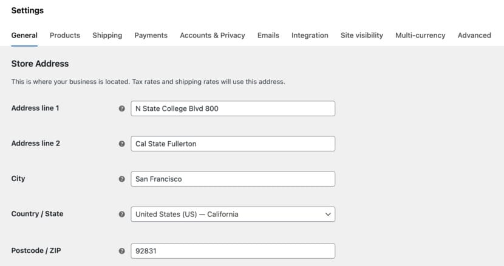
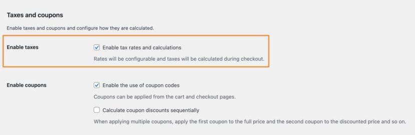
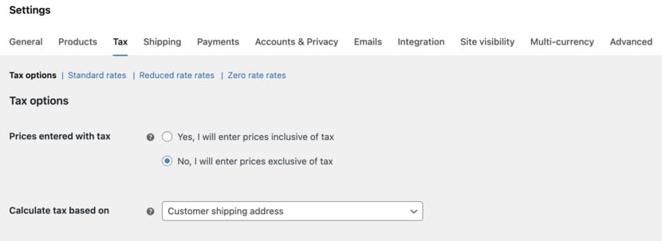
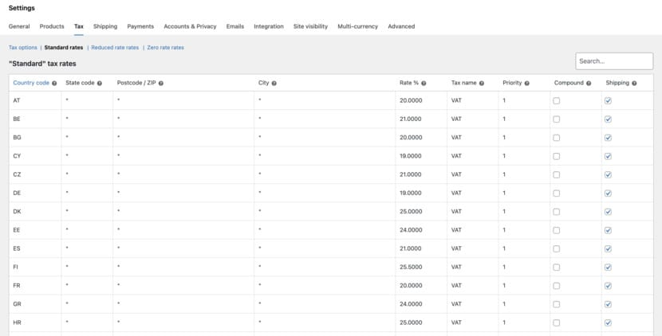
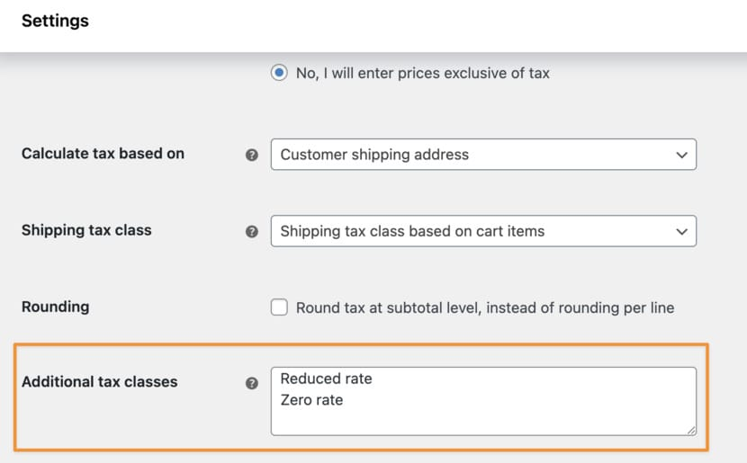
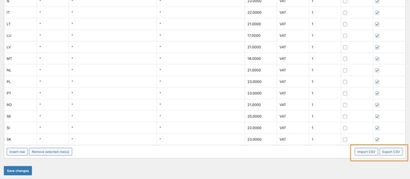

> [!summary]- Quick Summary
>
> - WooCommerce can calculate VAT correctly if your tax settings and rates are set up properly.
> - The painful part is collecting, validating, and storing EU VAT numbers consistently at checkout.
> - I use EU VAT Number for WooCommerce to handle that piece, and it has solved the practical EU VAT-number issues I’ve run into.
> - **This is not sponsored**. I just use the extension and recommend it based on personal experience.
>
> AI-generated summary based on the text of the article and checked by the author. [Read more](/artificial-intelligence-tools/ "BUT. Honestly Artificial Intelligence Tools") about how BUT. Honestly uses AI.

VAT is not hard in WooCommerce. The hard part is being consistent.

If you’ve searched for “WooCommerce EU VAT number”, “EU VAT WooCommerce”, or “VAT number WooCommerce”, you probably ran into dozens of different WooCommerce VAT plugins.

This essay is about one of them, based on my own experience running multiple businesses in the EU.

**Legal disclaimer**: I’m not a tax advisor, not an accountant, and definitely not an attorney. This is not professional advice. It’s practical experience plus in-depth knowledge of how WooCommerce works. For anything that affects your WooCommerce EU VAT compliance, talk to an accountant, and involve an attorney if you’re unsure about cross-border obligations.

## What This Essay Is And Is Not

This essay is not a promise of universal compliance. EU VAT depends on what you sell, where you’re established, where your customers are, and how you file (OSS, local registrations, thresholds, evidence rules, and so on).

What it is: a clean way to think about the split between:

- WooCommerce tax configuration (you must get this right)
- VAT number collection + validation + behavior (this is where most stores get stuck)

## Set Up Taxes Properly

Before you touch VAT numbers, make sure WooCommerce is charging VAT in the right places. If your taxes are already set up properly, you can skip ahead [to the snippet](#add-a-vat-number-field-in-woocommerce).

Go to **WooCommerce → Settings** and make sure your store address is correct. WooCommerce uses your store base location in a few important tax decisions, and “close enough” is how you end up with surprise reports.

Now go to **WooCommerce → Settings → Tax**. If you do not see a Tax tab, you likely need to enable taxes first in **WooCommerce → Settings → General → Enable Taxes** (wording varies slightly by version).

Once taxes are enabled, open the **Tax** tab.

### Choose How WooCommerce Calculates Tax

There are two decisions here that quietly affect everything:

1.  **Do you calculate tax based on the customer’s billing address, shipping address, or store base address?**  
    Most physical-goods stores end up using shipping. Many digital-only setups rely on billing. What matters is that you pick one and understand why.
2.  **Do you show prices inclusive or exclusive of tax?**  
    This is partly customer experience and partly regional expectation. In many EU contexts, inclusive pricing feels more normal. But again, pick intentionally.

Your accountant can help you decide on both of these settings.

### Add Your VAT Rates

Now go to **Standard rates** (or the tax class you use) and add rates for the countries you need.

WooCommerce can handle this as a table. You provide a country code and a percentage, and WooCommerce does the math at checkout.

This is where your accountant’s input matters a lot. The “right” rates depend on what you sell and where you sell it. WooCommerce will not stop you from entering something that looks plausible and is wrong.

If you sell multiple types of products with different VAT treatment, use **additional tax classes** instead of trying to hack it into one table.

For your convenience, I compiled a ready-to-import CSV file with all the current tax rates of all EU states from the [Europa.eu website](https://europa.eu/youreurope/business/taxation/vat/vat-rules-rates/index_en.htm#inline-nav-6). You can import it from **WooCommerce → Settings → Tax → Standard rates → Import CSV**.

## Where VAT Numbers Fit In

Most stores do not need to collect a VAT number from every customer.

It becomes relevant when you sell B2B, and especially when you sell across EU borders where a valid VAT number can change how VAT is charged and how you report it.

And this is the fork in the road:

- You can DIY it: add a VAT field, validate via VIES, store it on the order, and decide what happens to VAT.
- Or you can use a purpose-built extension that already handles the edge cases you only discover after your first “Why did this order get taxed?” email.

I used to write snippets for this. I don’t anymore.

## EU VAT Number for WooCommerce

Here’s what I want as a store owner:

1.  Customers can enter an EU VAT number at checkout
2.  The number is validated via VIES (so you are not trusting random strings)
3.  The VAT number is stored on the order (so you have an audit trail)
4.  If your accountant wants VAT removed for valid B2B intra-EU cases, it happens automatically
5.  If validation is unavailable, the store behaves sensibly (not “invalid,” but “can’t validate right now”)

That’s the stuff that actually matters day-to-day, and it’s why I recommend [EU VAT Number for WooCommerce](https://woocommerce.com/products/eu-vat-number/) now.

**This essay is not sponsored**. I just use it, and I think it solves the EU VAT-number side of the problem in a way that’s hard to replicate reliably with a couple of code blocks.

## The Benefit of Using the Extension

WooCommerce is already good at tax calculation when configured correctly. The weak point is everything around **VAT number handling**, because it’s full of real-world exceptions.

The extension isn’t “more complicated.” In practice it reduces complexity because:

- You stop maintaining custom code.
- You get consistent behavior that’s easier to explain to your accountant.
- You reduce the risk of subtle checkout regressions after theme, WooCommerce, or block changes.

So the new rule of thumb I use is simple:

- Do your core tax setup inside WooCommerce.
- Use EU VAT Number for WooCommerce for VAT numbers.
- Ask your accountant what a valid VAT number should do to VAT on the order.

## A Few Common Questions That Keep Coming Up

### How Do I Get An EU VAT Number?

You usually register with your local tax authority (or the relevant authority where you have a VAT obligation). The exact process depends on where your business is established and what you do.

If your setup includes OSS/IOSS, warehousing, or cross-border thresholds, this becomes accountant territory very quickly.

### Does A US Company Need A VAT Number To Sell Into The EU?

Sometimes, yes.

It depends on what you sell (digital vs. physical), where the sale is considered to happen, and whether you’re using schemes like OSS/IOSS. This is one of those questions where “it depends” is the honest answer. If you are a US company selling into the EU and trying to decide whether you need an EU VAT number, talk to an accountant who handles cross-border e-commerce, and pull in an attorney if you need a legal interpretation.

### Do I Need To Charge VAT To Non-EU Customers?

Often, EU VAT is tied to EU consumption, but the correct treatment depends on what you sell and the place-of-supply rules. This is another one for your accountant, because the “safe” answer is not always the same as the “common” answer.
