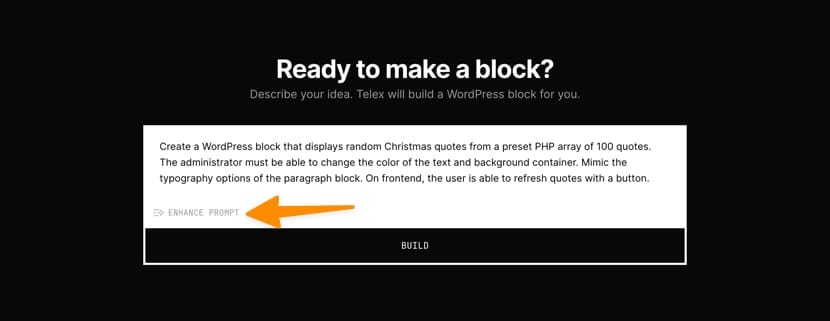
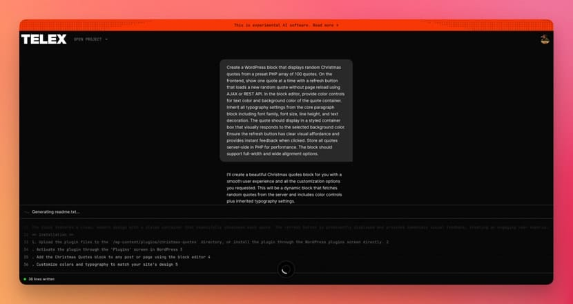
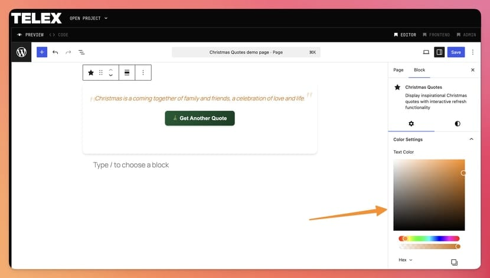

> [!summary]- Quick Summary
>
> - Telex is Automattic’s experimental AI tool that turns natural-language prompts into working WordPress blocks, delivered as focused single-block plugins you can install on any site.
> - It behaves like a focused vibe-coding assistant: you describe the block, Telex builds it, and you refine it with follow-up prompts or code edits.
> - It excels at small and medium blocks, quick prototypes, and boilerplate work, like the Christmas Quote generator block built from a single prompt.
> - The code might still need review and maintenance, especially for complex logic or sensitive features, but Telex meaningfully lowers the barrier to building custom WordPress blocks.
>
> AI-generated summary based on the text of the article and checked by the author. [Read more](/artificial-intelligence-tools/ "BUT. Honestly Artificial Intelligence Tools") about how BUT. Honestly uses AI.

If you spend time creating WordPress blocks in Gutenberg, Telex can feel like a bit of a superpower, almost like having a lightweight WordPress block template built into your browser.

This [experimental browser-based tool](https://telex.automattic.ai/) uses vibe coding to turn plain-English prompts into single-block WordPress plugins you can download and install on any site.

You type a description of the block you want, click a button, and a few minutes later you get a plugin zip with a working block inside. No build tools. No boilerplate. Just a new block waiting in the Gutenberg blocks editor.

In other words, Telex is vibe coding, but it only speaks WordPress blocks.

## Who Owns Telex And What It Actually Is

Telex was unveiled by Matt Mullenweg at WordCamp US 2025 as part of WordPress’ bigger move into AI-assisted development. It sits firmly in Automattic’s ecosystem, alongside WordPress.com, WooCommerce, Jetpack, and friends.

Officially, Telex is described as a free AI-assisted authoring  
environment for WordPress blocks, built to help you go from idea to working block without touching build tools. You sign in with a WordPress.com account, describe the block you want, and Telex generates all the code, previews it in an in-browser sandbox, and hands you a ready-to-install plugin zip.

So instead of learning how to create a WordPress Gutenberg block from scratch, you offload that work to Telex. It scaffolds the JavaScript, PHP, and CSS, wires everything together, and gives you something you can use immediately or refine by chatting with Telex itself or by hand.

## How Telex Creates WordPress Blocks Day To Day

Telex is built around a simple loop:

1.  Log in and describe the block you want in plain English.
2.  Click Build and wait while Telex writes and assembles the code.
3.  Preview the new block in a WordPress Playground environment.
4.  Refine the behavior with follow-up prompts or direct code edits, if necessary.
5.  Download the plugin zip and install it on your site.

From the outside, it looks like any other AI code assistant. Under the hood, it is much more opinionated. Telex knows about block registration, the differences between editor and frontend, block supports like alignment and color, and how WordPress expects assets to be loaded.

That means you can throw fairly high-level prompts at it:

- _“Create a WordPress block template for a pricing table with three columns and a toggle between monthly and yearly prices.”_
- _“Create a WordPress block that shows a button to create a Chicago-style citation of the post being read by the user, copying it to the clipboard.”_

Telex will not always nail the result on the first try, but the starting point is usually much closer than what you would get from a generic AI code editor with no WordPress context.

## Telex As Vibe Coding, With Guardrails

[[what-is-vibe-coding-how-to-do-it|In my earlier essay about vibe coding]], I described it as programming by conversation: you talk to an AI, the AI throws code back, and together you shape something that works.

Telex fits into that category, but with guardrails. It is not a general AI pair programmer. It is a specialized tool whose only job is to help you create WordPress blocks.

This focus matters. General tools tools can produce “WordPress-ish” code that technically runs but ignores conventions, performance, or accessibility. Telex is trained and tuned around WordPress’ patterns and Gutenberg’s block system, so it tends to respect those constraints more consistently.

If tools like Cursor and Lovable are broad-spectrum vibe coding, Telex is the “blocks-only” version. You still get the speed and fluidity of vibe coding, but with a much narrower problem space.

## One Prompt to Rule Them All

To see what this feels like in practice, I used Telex to build a Christmas Quote Generator block. The entire thing started and ended with one prompt:

```text
Create a WordPress block that displays random Christmas quotes from a preset PHP array of 100 quotes.

On the frontend, show one quote at a time with a refresh button that loads a new random quote without page reload using AJAX or REST API.

In the block editor, provide color controls for text color and background color of the quote container. Inherit all typography settings from the core paragraph block including font family, font size, line height, and text decoration.

The quote should display in a styled container box that visually responds to the selected background color.
Ensure the refresh button has clear visual affordance and provides instant feedback when clicked.

Store all quotes server-side in PHP for performance.
The block should support full-width and wide alignment options.
```

That is not a short prompt, but it is still just English. No code. No file structure. No build commands.

But honestly, that’s not the original prompt I used. Before you submit your prompt to Telex you can enhance your prompt within the interface itself. My initial prompt was this:

```text
Create a WordPress block that displays random Christmas quotes from a preset PHP array of 100 quotes.
The administrator must be able to change the color of the text and background container.
Mimic the typography options of the paragraph block.
On frontend, the user is able to refresh quotes with a button.
```

The Enhance Prompt feature turned it into the more WordPress-appropriate prompt that you see above.



I confirmed it was still what I wanted, submitted it, and Telex took it from there:

- It created a new plugin that registers a Christmas Quotes block.
- It created and stored the quote list in PHP so everything lives server-side.
- It wired a JavaScript function so the “Refresh” button can load a new quote without reloading the page.
- It built an editor interface that inherits typography from the core Paragraph block and exposes color controls.
- It added full and wide alignment support and a styled container that responds to background color changes.



And here is the working Gutenberg block:


If you were to do this by hand, you would go through all the usual steps: set up a plugin, configure build tooling, register the block, add attributes and controls, connect an AJAX or REST handler, and only then start polishing the UX. Telex effectively compresses that entire “WordPress create a block” journey into one prompt and a few iterations.

The result is not sacred. You can modify the code directly before finalizing the plugin, download the zip and inspect it, and modify it after testing it on your site. But you start from a working baseline instead of an empty folder, which is the whole point of vibe coding.

## Where Telex Shines

Telex really shines when you use it for small and medium-sized WordPress blocks that would otherwise feel like too much effort for their value. Think about:

- Utility blocks that wrap shortcodes, REST responses, or simple business logic.
- Display blocks that format existing content in more interesting ways.
- Internal tools and one-off blocks for a specific site or campaign.
- Quick prototypes for clients: “Here’s a first pass, let’s react to this instead of a sketch.”

For non-developers, this is where Telex is most magical. You can create WordPress Gutenberg blocks for your site’s particular needs without learning React or PHP. As long as you can describe the behavior clearly, Telex has an excellent chance of producing something useful.

For developers, Telex is a very fast block generator. It is great for scaffolding, for exploring variations, or for spinning up a rough WordPress block template that you then refine by hand. Once you have the working base, it is just code; you can adopt it into your standards, rewrite parts, or throw it away and try again.

It is also a surprisingly effective learning tool. If you are still getting comfortable creating blocks, you can study the code Telex generates, tweak it, and see the effect immediately in the editor.

## Where Telex Struggles

The tool is still experimental, and that shows. Even the official documentation and early write-ups emphasize that you will sometimes get broken blocks or code that needs manual fixes before it is production-ready.

You will hit limits in a few places:

- Complex multi-step flows or heavy business logic.
- Deep integrations that depend on specific third-party APIs.
- Blocks that require inner blocks or advanced editor interactions.
- Anything that requires serious performance tuning or security hardening.
- Fine-tuning block settings and options.



Like most AI-generated code, its output can be “confident but wrong.” You may still need to review the workflow, especially when it touches user input, payments, authentication, or data storage. It is faster than doing everything by hand, but it is not a substitute for understanding how WordPress works or how to make sure your users’ data are safe.

There is also the long-term question of maintenance. Telex makes it very easy to spin up lots of small plugins. Someone still has to maintain them when WordPress APIs change.

The good news is that the projects don’t die. You can always log back into Telex and edit your project from where you left it and download an updated version of the same block.

## How Telex Fits Into Real Workflows

In practice, Telex ends up sitting next to your existing tools rather than replacing them.

You might use it to:

- Prototype a new family of WordPress blocks before building a polished version in your main repo.
- Generate a minimal “WordPress indent block” experiment to try a layout idea, without polluting your production codebase.
- Whip up a quick “creating blocks” demo for a workshop or a client call, guided by live prompts.

The workflow usually looks like this:

1.  Sketch the idea in your head.
2.  Turn that idea into a single, clear prompt.
3.  Iterate with a few follow-up prompts until the block behaves correctly.
4.  Decide whether to ship it as-is or treat it as a prototype for a more deliberate implementation.

The more you use Telex, the more your prompts start to sound like specs. You get clearer about edge cases, data sources, and editor controls.

## Should You Use Telex for Creating WordPress Blocks?

If WordPress blocks are part of your daily work, Telex is worth exploring, even if you are skeptical about AI tools.

For site owners and content creators, it is a new way to get custom functionality without waiting for a developer to have free time. You no longer have to ask “Is this idea big enough to justify a full plugin or pay someone?” You can just try it.

For developers, Telex is another power tool. Some days it will only save you an hour. Other days it will hand you a surprisingly solid block that would have taken you a full afternoon to scaffold. Either way, it changes your sense of how quickly you can go from “idea” to “there is a block in my site.”

Telex is vibe coding, constrained to one of the most important surfaces on the web: WordPress blocks. That combination of speed and focus is worth paying attention to.

Do you have an idea for a WordPress block that you never got to build? [Try Telex](https://telex.automattic.ai/projects/new), or explore some of these [fun Telex remixes highlighted by Matt](https://ma.tt/2025/09/telex-remixes/).
