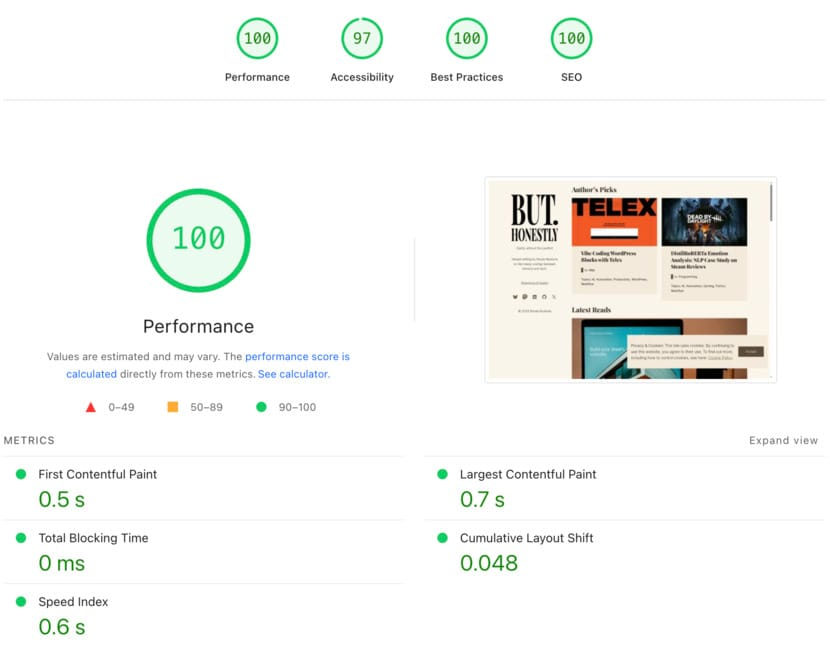
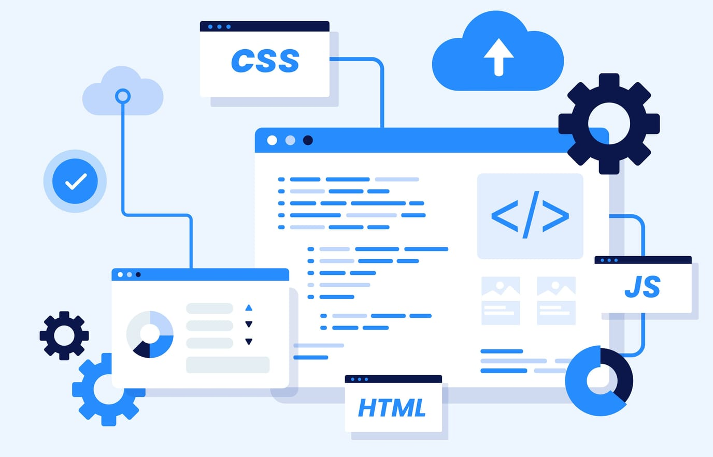

> [!summary]- Quick Summary
>
> - This site uses a minimalist stack, the Bitácora theme, a few essential plugins, and no or heavy visuals to hit ~81 mobile and 100 desktop on PageSpeed Insights.
> - Performance comes first: fast loads build trust, boost engagement, and directly support SEO through better Core Web Vitals.
> - Once speed is solid, design matters for readability and identity; typography, spacing, and simple visuals can stand in for flashy effects.
> - Treat design as polish with a purpose; remove sliders, videos, or animations that don’t clearly have a purpose.
> - Use tools like lazy loading, WebP images, and local fonts, set a PageSpeed baseline, and retest after every design change to keep the balance right.
>
> AI-generated summary based on the text of the article and checked by the author. [Read more](/artificial-intelligence-tools/ "BUT. Honestly Artificial Intelligence Tools") about how BUT. Honestly uses AI.

This blog has no fancy animations, no custom fonts, and barely any images. That’s entirely by design. I use the WordPress [Bitácora theme](https://wordpress.com/theme/bitacora), just a [[top-5-essential-wordpress-plugins-i-always-install-and-why|few essential plugins]], and that’s it. The result? An 81 on mobile and 100 on desktop in Google PageSpeed Insights.

When every site tries to outshine the rest with gradients, parallax scrolling, and animated backgrounds, I’ve gone the opposite way, and I couldn’t be happier. A fast, clean, minimal website doesn’t just feel good to manage; it feels good to _use_.

But I’ll admit, design still matters. Readers remember good experiences, not just good scores. The challenge is knowing when to prioritize speed and when to let visuals shine, even if they cost a few milliseconds.

This post explores that balance: how performance impacts user experience and SEO, when design truly adds value, and how you can find the sweet spot between the two.

## Why Performance Comes First

A beautiful website is pointless if it’s slow to load. Visitors leave before they even see the design, and search engines notice that. Performance isn’t just a technical metric, it’s a vital part of user experience.

When a page loads instantly, it gives the impression of quality and reliability. Users trust it more, stay longer, engage better, and purchase more. A slow site, on the other hand, feels outdated or broken, no matter how nice it looks.

That’s why I built my blog around _speed first_. I rely on the WordPress Bitácora theme and minimal plugins, no visual builders, and no unnecessary scripts. I don’t use featured images, custom fonts, or heavy effects. Almost everything is native or custom-built for this site, lightweight, and easy to maintain.

The payoff is immediate:

- Google PageSpeed Insights shows **81 / 100** on mobile and **100 / 100** on desktop at the moment of writing.
- Pages load almost instantly, even on slow connections.
- Updates are simple; fewer moving parts mean fewer issues. In the case of this blog, I have all plugins and theme updated automatically through [Jetpack](https://jetpack.com).

Optimizing for performance also improves SEO. Core Web Vitals like **Largest Contentful Paint (LCP)** and **First Input Delay (FID)** directly influence search rankings. A lean site naturally performs well here.

Focusing on performance first gives you a solid foundation. Once your site is fast, stable, and functional, _then_ you can safely add layers of design without hurting the experience.

## When Design Starts to Matter

Speed wins attention, but design keeps it.

Once your site loads fast and feels smooth, visuals become the next piece of the puzzle. A clean but _well-designed_ layout builds trust, improves readability, and gives your content identity. It’s what makes visitors remember _your_ site among the thousands they scroll through.

Design isn’t just about aesthetics. It’s about **communication**. Typography guides the eye, spacing gives clarity, and subtle color choices create hierarchy. Even something as simple as using an image can break up long posts and give them character.

If your site is new, or you’re still growing your audience, focus on **clarity and speed** before anything else. Good structure, readable typography, and consistent spacing already count as _design_; they don’t need to be fancy to work.

Where many sites go wrong is in trying to do too much too early. Full-screen sliders, background videos, animated transitions, and large hero images might look impressive, but they come at a cost: longer loading times and higher bounce rates.

Think of design as polish. It’s what turns a functional site into a memorable one, as long as it doesn’t undo the performance work you’ve already done.

Once your site has a steady flow of visitors and strong performance, then you can experiment with more visually rich elements. But even then, moderation is key. One well-placed image or subtle animation can add personality without slowing the experience.

## Finding the Balance

Design and performance don’t have to be enemies, they just need boundaries. The key is knowing what adds value and what adds weight.

A practical rule I follow is this: **never let design elements exist without purpose**. If a slider doesn’t improve engagement, remove it. If an animation doesn’t guide attention, it’s just decoration that slows things down.

You can absolutely have a beautiful, modern site _and_ great performance. Tools like **lazy loading**, **[WebP images](https://jetpack.com/features/design/content-delivery-network/)**, and **locally hosted fonts** make it easier to add design without hurting your scores. The trick is to measure every change. After each adjustment, recheck your Core Web Vitals and Google PageSpeed results. [[do-you-trust-your-instincts-making-smart-wordpress-choices|Make smart choices]] when it comes to adding plugins.

Another good habit is to set a **performance baseline**. For example, keep mobile speed at least 80 on PageSpeed Insights. Whenever you make a design update, test again. If your score dips significantly, you know the change wasn’t worth it.

In the end, both design and speed serve the same goal: a better user experience and more engagement and conversions. Performance earns trust instantly; design builds connection over time. The right balance is the one that makes your site _feel effortless_ to read and enjoy.

## What It Comes Down To

You don’t need an elaborate design to have a great site. What you need is focus on clarity, speed, and purpose. A fast site invites readers in; thoughtful design keeps them there.

My approach has always been to start simple. Use what’s necessary, skip what’s not, and measure everything. That’s how I ended up with a site that feels light, clean, and fast, even if it looks a bit plain at first glance. It serves its purpose perfectly: to deliver high-quality content to technical readers who are here for that content, not for the design of my site.

But minimal doesn’t mean boring. It means intentional. Every decision, from skipping featured images to avoiding custom fonts, is made to serve performance and readability. When design finally comes into play, it should enhance those strengths, not compete with them.

In the end, the best design is the one that feels invisible because performance lets it shine.
