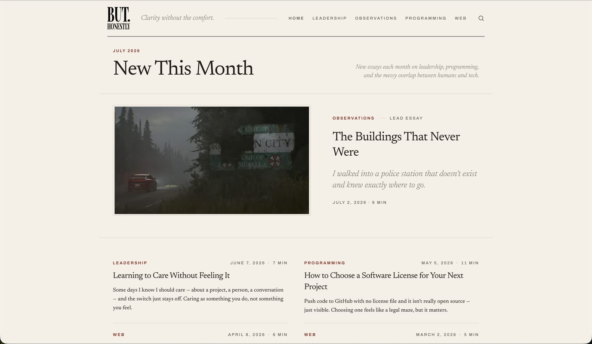
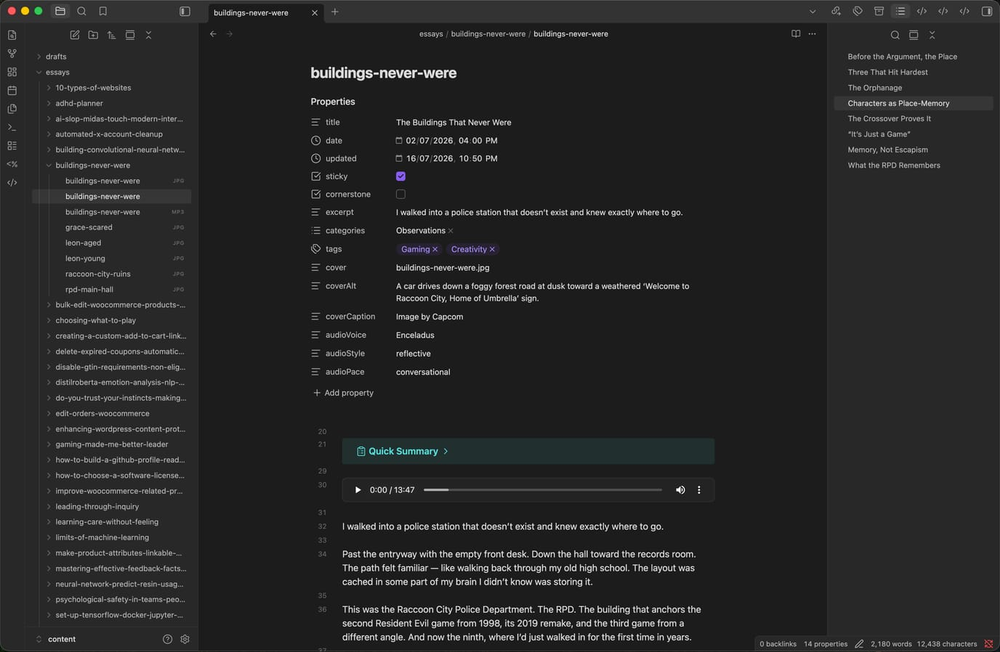
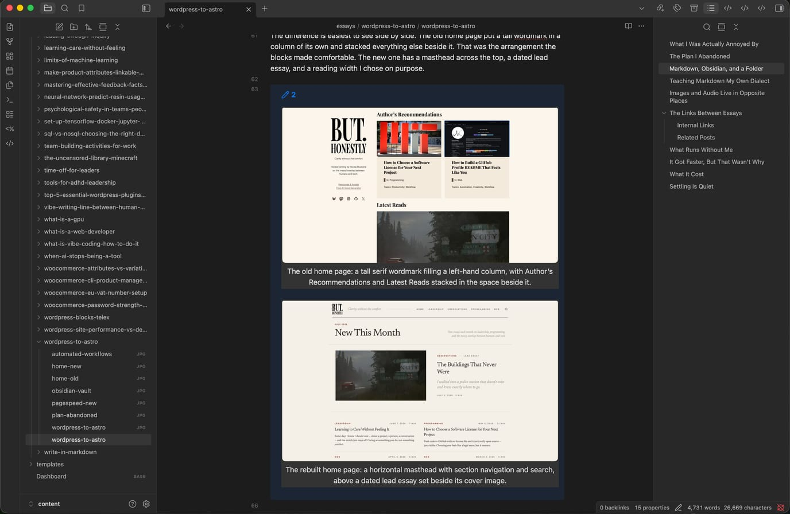
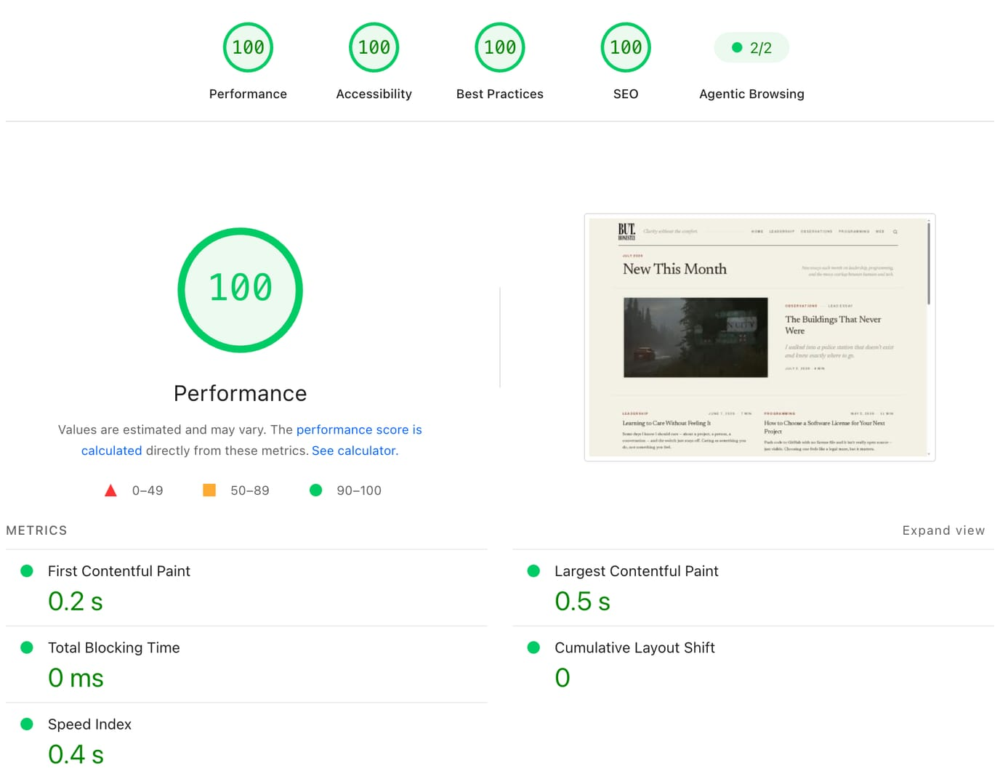

> [!summary]- Quick Summary
>
> - The old site worked, which is exactly why it took me so long to leave. Every time the Site Editor almost did what I wanted, I shipped the almost.
> - My first plan was headless WordPress. The pre-flight checks passed, and passing is what showed me the backend wasn’t earning its place.
> - An essay is now a folder: one Markdown file and its images. A future date schedules it, and publishing is a commit.
> - Four small remark plugins teach the build Obsidian’s dialect, so the file I write in the vault is the file the site renders.
> - Related posts come from sentence embeddings rather than term matching. With internal links, the real cost was never adding them. It was finding where they belonged.
> - The site got faster, from 81 to 97 on mobile, but speed wasn’t the motive. I had been quietly trading design away to protect a score.
> - Settling doesn’t feel like settling. It feels like being reasonable, one sensible decision at a time.
>
> AI-generated summary based on the text of the article and checked by the author. [Read more](/artificial-intelligence-tools/ "BUT. Honestly Artificial Intelligence Tools") about how BUT. Honestly uses AI.

![[wordpress-to-astro.mp3]]

I never disliked the old site. That was the problem.

If I had hated it, I would have never shipped it like that to begin with. Instead I liked it fine. It loaded, it looked reasonable, people read it, it had no serious performance concerns. Every time something bothered me I opened the Site Editor, found the block that almost did what I wanted, and shipped the almost.

That’s not a dramatic failure. Nobody writes an essay about a site that works.

But the almosts add up. After enough of them you stop asking for the thing you actually want, because you already know the answer. You start designing inside the shape of the tool, and after a while you can’t tell where the tool’s limits end and your taste begins.

I only noticed once it was gone.

It runs on [Astro](https://astro.build) now. The essays are Markdown files in a folder, the build is static, and nothing gets assembled while you wait. That part took a month. Noticing why I wanted it took years.

## What I Was Actually Annoyed By

The Site Editor isn’t a bad piece of software. It’s a general-purpose tool doing a general-purpose job, and it does that job for millions of sites that aren’t mine.

That’s the friction. My site is one person writing essays. I don’t need a theme that can become a restaurant, a storefront, and a portfolio. I need a reading column, a typographic scale I chose, and the ability to change one of them without discovering which four other things it also changed.

Every fix was a negotiation. I would want a small change — spacing, a border, the way a caption sat under an image. The path to it ran through a settings panel, then a theme.json value, then some custom CSS wedged into the Additional CSS box. Which is where styles go to be forgotten.

Sometimes I went searching for a plugin that adds the one block I wanted. More often I wrote the PHP snippet myself. The alternative was paying for a bloated plugin that does what a single function does.

The result worked. It just wasn’t designed so much as *arrived at*.

The difference is easiest to see side by side. The old home page put a tall wordmark in a column of its own and stacked everything else beside it. That was the arrangement the blocks made comfortable. The new one has a masthead across the top, a dated lead essay, and a reading width I chose on purpose.

> [!gallery] 2
> 
> 

Neither of those is a dramatic redesign. That is rather the point — the second one is what I wanted the whole time, and it was never more than a layout decision away.

> _“You start designing inside the shape of the tool, and after a while you can’t tell where the tool’s limits end and your taste begins.”_

## The Plan I Abandoned

The first plan wasn’t this one.


I was going to go headless. Keep WordPress as the place I write, have Astro read its REST API at build time, and deploy the result as static files. It’s a well-worn migration path and a sensible one. You keep the editor you know and get the front end you want.

I rehearsed it on [my portfolio site](https://nicolamustone.com) first. A few posts, two pages, nothing much to lose if it went badly. The pre-flight was a short checklist: does the API return what I need, is the SEO data there, which URLs break.

Most of it passed. The API handed back clean JSON with excerpts, featured images and taxonomy terms, exactly as documented.

Then two things.

The SEO check passed in a way that made the backend look thin. There was no plugin output worth inheriting — the Jetpack fields existed and were empty. Whatever metadata the new site needed, I was going to generate it in Astro myself.

The second was smaller, and it decided the whole thing.

A static site has to be told when to rebuild. In a headless setup that trigger is a webhook, fired on publish. WordPress.com doesn’t have one on plugin-enabled sites.

So I was back to the familiar two options. Install something that does it along with thirty things I never asked for, or write the one function myself.

I wrote the function. It’s about as small as you would expect, it works, and it still runs on my portfolio site today.

Which is when I noticed the shape of what I was doing. This was the same trade I had been making inside the Site Editor for years, one layer further down. Want one specific thing, get told to install something enormous or build it yourself.

Then I looked at what I actually had. A publish trigger I wrote. Metadata I was generating myself. A front end I was about to build from scratch.

That was the moment I stopped.

What was WordPress still doing? Holding text in a database, and giving me an editor I didn’t need.

The checklist said go. The instinct said the backend was dead weight, and I have [[do-you-trust-your-instincts-making-smart-wordpress-choices|written before about trusting that instinct]] on WordPress decisions.

I was one phase away from carefully preserving the exact thing I wanted to leave.

## Markdown, Obsidian, and a Folder

An essay on this site is a folder.

Inside it sits one Markdown file named after the folder, and the images that belong to it. That’s the entire content model. No database, no media library, no post ID. If I want to know what an essay is made of, I open the folder and look.



I have [[write-in-markdown|written in Markdown for most of my work]] since 2015, so this part wasn’t a leap. What changed is that the Markdown is now the thing that ships, rather than something I paste into a form afterwards.

I write in Obsidian, which is pointed straight at the content directory. The vault and the site are the same files. There’s no import step and no export step, because there’s nowhere for the text to go.

Publishing is a date.

There’s no draft toggle and no status field. A date in the future means the essay is scheduled; once that date passes, an hourly job on GitHub notices and rebuilds. Work in progress lives in a `drafts` folder that the site doesn’t build at all. Moving the folder is the act of publishing.

Two small things shaped this more than they should have.

Obsidian’s property editor can’t edit nested objects — it shows them as an unknown format. So the narration settings are three flat fields rather than one tidy `audio` map. The data model bent to fit the editor. There is some irony in leaving one editor’s limits and then designing around another’s. The difference is that I picked this editor, and I can see exactly where the limit sits.

The other is smaller. Every field in my `new-essay` template ships blank, and a blank YAML value arrives as `null` rather than as nothing at all, which a strict schema rejects. So the schema has a preprocessor that turns empty into absent. It took twenty minutes to find and one line to fix.

Nobody will ever notice either of these. That’s roughly the point. The compromises are still there, they’re just mine now, and I know where I put them.

## Teaching Markdown My Own Dialect

Here is the problem with writing in Obsidian and publishing somewhere else.

Obsidian’s best syntax isn’t Markdown. Wikilinks, callouts, embeds — none of that is standard. A normal build pipeline reads `[[buildings-never-were]]` and prints the brackets.

So I had two options. Stop using the syntax, or teach the build to read it.

I wrote four small plugins. They run while the Markdown is being parsed, and each one handles a piece of the dialect.

> [!screen-only]
> Links first:
>
> ```markdown
> I have [[write-in-markdown|written about this before]].
> ```
>
> In the vault that is a working link between two notes. On the site it becomes `/write-in-markdown/`. Same characters, both places, no conversion step.

> [!audio-only]
> Take links first. In the vault I write an essay's name inside double square brackets, which is how Obsidian links one note to another. On the site those same characters come out as an ordinary link to that essay. Same file, both places, no conversion step.

The rule I set was that the file has to make sense in Obsidian *and* on the site. Every time I broke that rule the writing got worse, because I started thinking about output while drafting.

Galleries are the clearest case. I wanted a grid of images. The obvious way is a `<div>` with a grid class, and it works. But Obsidian’s Live Preview hides raw HTML until you click into it, so while writing I would see a blank gap where two photos should be. The images inside it would also skip the build’s image handling entirely.

> [!screen-only]
> So a gallery is a callout:
>
> ```markdown
> > [!gallery] 2
> > 
> > 
> ```
>
> 
>
> That is the comparison from earlier in this essay, seen from the other side. The site turns the same block into a two-column grid, and the images go through the same pipeline as every other image on the page. Nothing is hidden from me while I write.

> [!audio-only]
> So a gallery is written as a callout instead. I mark the block as a gallery, tell it how many columns I want, and list the images inside it. Obsidian shows it as a box with the images already in place, which is how the comparison earlier in this essay looked while I was writing it. The site turns the same block into a two-column grid, and those images go through the same pipeline as every other image on the page. Nothing is hidden from me while I write.

The unglamorous part is that the plugins fight over the same characters. Audio embeds are written `![[essay.mp3]]`, which the wikilink plugin will happily eat and turn into a broken link, so audio has to run first. Galleries are blockquotes with a `[!marker]`, which the callout plugin would claim, so galleries run before callouts. Both files open with a comment saying so, because I won’t remember in six months.

All four are in the [repository](https://github.com/SirDarcanos/buthonestly.io), which is public and MIT licensed. The code is worth exactly what you paid for it. But if you want to see what teaching Markdown a dialect looks like, it is about two hundred lines of nothing clever. The essays themselves stay mine, under a Creative Commons licence — the front end is the part I am giving away.

That is the honest version of "fully customizable." It doesn’t mean everything is easy. It means the constraints are mine, written down in a file I can open.

If I want to change how things work, and I might eventually, I open a file and edit it. I don’t have to file a request and wait for a release cycle that isn’t built around one person’s blog.

## Images and Audio Live in Opposite Places

Images are in git. Audio isn’t. That difference took me a while to arrive at, and it explains most of how both work.

An image is a build input. The JPEG I commit isn’t what you download — Astro re-encodes it to AVIF and WebP at the right sizes, and your browser picks. Keeping the source in the repo means the build can always redo that work when the tooling improves.

Which is why the rules around them are strict.

A cover has to be 16:9, and a script checks before every commit. If it isn’t, the commit stops. That sounds heavy-handed for a personal blog. But resizing by width never crops. A 4:3 cover doesn’t get letterboxed, it gets stretched, and I’d have shipped it without noticing.

Body images are looser, because a wide dataset strip or a tall diagram is fine. Only width matters there.

The optimizer also converts anything opaque to JPEG and rewrites the Markdown reference to match, so I can drop a PNG in the folder and forget about it. Transparency stays PNG, since JPEG has no alpha. Animated GIFs get skipped entirely, because AVIF is a single frame and a GIF would arrive as a still.

Audio goes the other way. The narrations are tens of megabytes each, they’re generated rather than authored, and nothing in the build depends on them. They live in object storage and the repo never sees them.

What I didn’t expect was that generating them would turn into an editing pass.

The narration script runs twice. The first run costs nothing. It reduces the essay to what will actually be spoken, splits it into chunks, and writes that to a file beside the Markdown. Then I read it.

An acronym that needs spelling out, an image caption that made sense under a photo and makes none in the ear — those get fixed there. The second run synthesizes from the edited file, not from the essay.

So the spoken version isn’t a reading of the page. It’s a version of the essay edited for being heard, which is a thing I didn’t know I wanted until I had it. There’s even a pair of markers for passages that should exist in only one medium, though reaching for them usually means the sentence needs rewriting instead.

The last piece is a check I’m fond of. After synthesis the script compares the speaking rate of every chunk against the median for that run, and flags the outliers. A chunk much faster or slower than the rest is usually one where the model dropped a clause or repeated one. It doesn’t tell me the narration is correct. It tells me which ninety seconds to actually listen to, which for a long essay is the difference between checking the work and pretending to.

## The Links Between Essays

There are two kinds of links on this site. The ones I choose, and the ones the site chooses.

Both were worse before, in different ways.

### Internal Links

The ones I choose are internal links, and I had that problem backwards for years.

Adding a link is nothing. It never took long enough to matter.

The cost is finding them.

Every new essay creates link opportunities inside essays I wrote months or years ago. A paragraph from 2023 that should now point at something I published last week. Nobody sees those unless somebody goes looking, and the somebody is me, rereading forty-five essays I know far too well to read carefully.

So I did it once, at publication, and then I mostly didn’t. The archive slowly drifted out of date with itself.

There are tools for this. SEO plugins that crawl your content and suggest where to link. The ones that work well are very expensive, and the ones I tried at the price I was willing to pay didn’t work well enough to keep.

Now the whole body of work is plain text in one folder. I can point a model at it and ask where a new essay should be linked *from*, and get back specific paragraphs in specific posts. Then I read the list and throw half of it away, because a suggestion is only a suggestion and the judgment is the part worth keeping.

Editing the file afterwards takes seconds. Two brackets, and Obsidian autocompletes the slug.

What changed isn’t the linking. It’s that finding got cheap, so it actually happens.

### Related Posts

The ones the site chooses are the related posts under each essay, and those I was never happy with.

Jetpack’s version does more than people assume. It doesn’t just match tags. It runs the actual post content through Elasticsearch on WordPress.com’s servers, and weighs categories and tags alongside it. It won’t render at all unless it finds at least three results it rates as good. All of that happens in their cloud, so it costs your server nothing.

It’s a good piece of engineering. It just wasn’t as precise as I want it to be.

In practice the matching is lexical. Two essays using the same words score as related. Two essays making the same argument in different vocabulary often don’t. So a post about WooCommerce coupons can land under a post about leading a team, because both talk about a store. Meanwhile the essay that genuinely continues the argument sits elsewhere, using none of the same nouns.

The plugins that promised better were mostly paid, and the free ones did the same job worse.

So now a neural network does it.

Every essay gets run through a small sentence-embedding model, which turns the text into a vector — a few hundred numbers describing roughly what the piece is about. Two essays that argue similar things end up close together in that space. For each essay I take the six nearest neighbours, nudge the score slightly for a shared tag or category, and write the result to a file.

That file is committed. The site reads it at build time and never at runtime, so nothing is computed while you’re waiting for the page.

The parts I like are the boring ones. The model is about two hundred megabytes, and it isn’t a dependency of the site. It gets installed only inside the job that regenerates the map, so the deploy stays light. 

Each essay’s vector is cached against a hash of its text, so an essay only gets re-embedded when I actually change it. And an essay published before the map catches up falls back to shared tags and recency. The old behaviour, kept quietly as a floor rather than a ceiling.

None of that makes it clever. It’s similarity, not comprehension, and it has [[limits-of-machine-learning|the same limits everything else in this family has]]. It puts two essays together because their meaning points the same way, which is not the same as understanding either one. When it is wrong, it is confidently wrong.

So this isn’t a bad tool replaced by a good one. One matches words, the other matches direction. For a site where the same argument keeps coming back in different clothes, direction is the one I needed.

The honest reason I prefer mine is smaller than that. I can open the file, see the weights, and change them. If tomorrow I want the tags to have more importance than the categories, I can do that.

## What Runs Without Me

Publishing is a commit. Everything after it is a consequence.


Four scheduled jobs watch the repository. One rebuilds the site when an essay’s date comes due. A piece written in June goes live on a Tuesday in August without me opening anything. 

One regenerates the related-posts map. One tells Bing, Yandex, Seznam and Naver that something changed, since Google doesn’t take that kind of notification and finds it through the sitemap anyway. One emails subscribers.

Every one of them also runs on a daily timer, for a reason that took me longer to see than it should have. A date passing is not an event. Nothing happens when the clock rolls over an essay’s publish time — no webhook, no signal, nothing to react to. Something has to wake up and check.

The part nobody warns you about is that most of the work is making sure a job doesn’t do its job twice.

Each of them keeps a small ledger, committed alongside the site. Which essays have been announced, which URLs have been submitted, and a hash of the content each time. Resubmitting unchanged URLs is how you get throttled by a search engine. Re-announcing an essay is how you email the same person the same thing on a Tuesday and again on a Wednesday.

The newsletter ledger had to be seeded before the first run.

Without it, the job would have looked at forty-one already-published essays and correctly concluded that none had been announced yet. Then sent forty-one emails to everyone who had ever subscribed. It would have been right about every single one of them. That’s the failure mode of automation I keep [[automated-x-account-cleanup|running into]]: the script does exactly what you asked, at a scale you didn’t picture.

So the jobs are careful, and boring, and mostly do nothing. An hourly check that finds no essay due exits in a few seconds. That’s the correct outcome, several hundred times a week.

What I get for it is the thing I actually wanted. I finish an essay, set a date, and commit. Whether it goes out at nine in the morning while I’m asleep is not my problem anymore, and it isn’t anybody’s server either.

## It Got Faster, But That Wasn’t Why

I should be careful here, because the honest version is less impressive than the version I could tell.

The old site was not slow. It scored 81 on mobile and 100 on desktop, and I know those numbers precisely because I [[wordpress-site-performance-vs-desig|wrote an essay about them]] in March.

Reading that essay back is uncomfortable in a useful way. Here is how I described the site then:

> This blog has no fancy animations, no custom fonts, and barely any images. That’s entirely by design.

I presented that as discipline. It reads now like an inventory of things I had given up.

I even wrote down the rule I was following. Keep mobile above 80, retest after every design change, and if the score dips significantly, the change wasn’t worth it. That is a reasonable policy. It is also a policy that can only ever subtract, and I had been running it for years without noticing what it had quietly talked me out of.

The new site scores 97 on mobile and 100 on desktop. It has custom fonts. It has a cover image on every essay, a typographic scale I chose, and a reading column measured rather than inherited.



The desktop score is the interesting one, because it didn’t move and it couldn’t. It was already at the ceiling. But the metrics underneath it are not the same at all:

| Desktop | Old | New |
| --- | --- | --- |
| First Contentful Paint | 0.5 s | 0.2 s |
| Largest Contentful Paint | 0.7 s | 0.5 s |
| Speed Index | 0.6 s | 0.4 s |
| Cumulative Layout Shift | 0.048 | 0 |

A perfect score doesn’t mean a page is as fast as it can be. It means it cleared the bar. Both sites clear it, and one of them clears it in half the time, and the score has no way to say so.

The mobile gain is the same change made visible. Mobile testing assumes a slower processor and a worse network, so it punishes work. Nothing here is optimized in a way the old site wasn’t. There is simply less to do.

A page is a file. It was built days ago, it sits on a CDN near whoever asked for it, and answering the request means handing it over. No PHP starts up, no database is queried, no plugin gets a chance to add a script to the head.

The whole site ships about thirteen kilobytes of JavaScript across five small files, none of it a framework. Images arrive as AVIF at the size the layout actually uses, with their dimensions known in advance, which is the entire reason layout shift went to zero. Nothing reflows, because nothing arrives unannounced.

None of that is clever engineering. It’s the same page with fewer participants.

And a personal essay site is the easy case. No logged-in users, no cart, no comments, nothing that has to be true at the moment you ask for it. Everything I removed was something I could afford to remove, which is not a general argument about anything.

Sixteen points on mobile is real, and it isn’t why I did this. The part that matters is that I stopped choosing between the two.

## What It Cost

Two hundred and twenty commits in about four weeks. That is the honest headline number, and it doesn’t include the month of planning that produced a migration I then abandoned.

The rest of the cost is quieter. WordPress gave me a set of things for free that I now own outright: search, the newsletter, related posts, the RSS feed, the sitemap, every meta tag. None of those were hard. All of them are mine to fix at eleven at night when something breaks.

The redirects were the part that actually frightened me. Ten years of URLs in three or four different shapes, all of which strangers have linked to and search engines have indexed. That’s a hundred lines of rules in a file, and if I got one wrong, the failure is silent. Nobody emails you to say a link from 2018 stopped working.

There is no wp-admin anymore, which is mostly the point and occasionally the problem. A typo in a published essay is now a commit, a push and a build. I can’t fix one from my phone while standing in a queue.

And I should be straight about the motive. Part of why I did this was that I wanted to learn Astro, TypeScript, and Tailwind properly. A real site with real readers is the only way I ever learn anything properly. That’s a legitimate reason. It’s also not a reason that transfers to anyone else, so nothing here is advice.

If your site works and you don’t want to spend a month inside it, your site works. That was true of mine.

## Settling Is Quiet

The thing I learned isn’t that Astro is better than WordPress. It isn’t. It is the same lesson [[what-is-a-web-developer|the slow way I learned to build for the web]] keeps teaching me. They’re answers to different questions, and I was asking the wrong one for years without noticing.

What I learned is that settling doesn’t feel like settling.

It feels like being reasonable. The rule I wrote down in March — retest, and if the score dips, the change wasn’t worth it — was reasonable. Every time I opened the Site Editor and shipped the block that almost did what I wanted, that was reasonable too. Each individual compromise was the sensible call, made by someone who had other things to do that day.

They only look like a pattern from outside, and you can’t get outside a tool while you’re still holding it.

I don’t think the old site was a mistake. I think I stopped being able to see it and love it.
